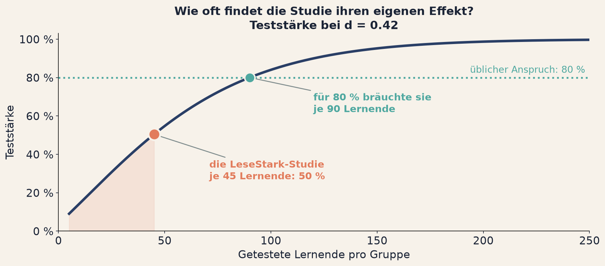

<!--
Verlinkte Seiten dieses Decks, hier zentral pflegen:
  Arbeitsblatt   ../../tag1/e1-pwert.html
  App Streuung   ../../apps/a01-schwelle.html
  App n treibt p ../../apps/a02-stichprobengroesse.html
Pfade sind dokumentrelativ und funktionieren dadurch in der Vorschau wie unter
der Projektseite auf GitHub Pages. Ein fuehrender Slash waere hier falsch.
-->

# Einheit 1 {.bp-trenner background-color="#E27C5C"}

[Tag 1 · Die Diagnose]{.bp-eyebrow}

## Was der p-Wert nicht sagt

::: notes
**Faden.** Davor: Auftakt und Technikcheck, alle haben die Seite offen.
Hier: der Titel ist die Behauptung, der Rest der Einheit ist der Beleg.
Überleitung: "Bevor ich irgendetwas behaupte, eine Frage an euch."

Kurz stehen lassen, fünf Sekunden.
:::

## Welche dieser Aussagen ist richtig?

Eine Evaluationsstudie zum Leseförderprogramm **LeseStark** berichtet
**p = .01**.

::: {.bp-aufgabe}
1. Die Nullhypothese ist mit 1 % Wahrscheinlichkeit wahr.
2. Der Effekt ist real, denn p liegt unter .05.
3. Der Effekt ist groß, jedenfalls größer als bei p = .04.
4. Die Wahrscheinlichkeit, dass sich der Befund replizieren lässt, ist 99 %.
5. Die Wahrscheinlichkeit, dass das Ergebnis reiner Zufall war, ist 1 %.
6. Wäre p größer als .05, gäbe es keinen Effekt.
:::

::: {.bp-handzeichen}
Handzeichen bitte. Bei jeder Aussage einzeln.
:::

::: notes
**Faden.** Davor: der Titel als Behauptung. Hier: sechs Aussagen zu einem
p-Wert von .01, Handzeichen bei jeder einzeln. Überleitung: "Ich sage euch
jetzt, wie viele davon stimmen."

Das ist der wichtigste Moment der ganzen Einheit. Nicht überspringen, und nicht
abkürzen.

Ablauf: jede Aussage einzeln vorlesen, dann Handzeichen abwarten. Ruhig etwas
Zeit lassen, auch wenn es still wird. Erfahrungsgemäß gehen viele Hände hoch
bei "der Effekt ist real, denn p liegt unter .05", bei "die
Replikationswahrscheinlichkeit ist 99 Prozent" und bei "die Wahrscheinlichkeit,
dass es Zufall war, ist 1 Prozent".

In Zoom die Reaktionsfunktion nutzen und selbst laut mitzählen: "vier Hände,
sechs Hände". Sonst sieht niemand, wie die Gruppe steht, und der Effekt der
Folie verpufft.

Wichtig ist der Ton. Das ist kein Test, bei dem jemand durchfällt. Ich sage
vorher: "Ich habe das selbst jahrelang falsch gehabt, und die Leute, die
Methoden unterrichten, haben es auch falsch." Das nimmt den Druck raus und macht
den Raum ehrlich.

Wenn niemand die Hand hebt, weil alle den Trick ahnen: dann frage ich stattdessen
"Welche davon habt ihr schon einmal so in einem Paper gelesen?" Das funktioniert
immer.

Rund 3 Minuten.
:::

## Alle sechs sind falsch

::: {.bp-warn}
Keine einzige der sechs Aussagen trifft zu. Sie sind nicht ungenau, sie sind
falsch.
:::

::: {.bp-stats}
::: {.bp-stat}
[100 %]{.bp-stat__num}
[der befragten Studierenden machten mindestens einen Fehler.]{.bp-stat__label}
:::
::: {.bp-stat}
[90 %]{.bp-stat__num}
[der forschenden Psychologinnen und Psychologen ebenfalls.]{.bp-stat__label}
:::
::: {.bp-stat}
[80 %]{.bp-stat__num}
[der Methoden-Lehrenden ebenfalls.]{.bp-stat__label}
:::
:::

::: {.bp-quelle}
Haller & Krauss (2002), *Misinterpretations of significance*, Methods of
Psychological Research Online 7(1). Genau diese sechs Aussagen wurden dort
vorgelegt.
:::

Mehr Methodenausbildung hilft. Von 100 auf 80 Prozent.

::: notes
**Faden.** Davor: das Quiz mit den erhobenen Händen. Hier: die Auflösung, keine
einzige Aussage stimmt, und das gilt bis in die Lehre hinein. Überleitung:
"Wenn alle sechs falsch sind, dann sollten wir einmal klären, was der p-Wert
eigentlich ist."

Die Auflösung ohne Triumph vortragen. Der Satz, der sitzen muss: das ist kein
individuelles Versäumnis, sondern ein Ausbildungsproblem.

Die Zeile "Mehr Methodenausbildung hilft. Von 100 auf 80 Prozent." ist ironisch
gemeint und muss auch ironisch klingen, sonst kippt sie ins Gegenteil. Der
Zusatz dazu: die Lehrenden liegen besser als die Studierenden, aber immer noch
zu vier Fünfteln falsch. Mehr vom Gleichen löst das Problem nicht.

Haller und Krauss (2002) haben Studierende, wissenschaftliche Mitarbeitende und
Methoden-Lehrende befragt. In allen drei Gruppen lagen die Fehlerquoten hoch. Der
Befund ist mehrfach repliziert worden und gilt bis heute.

Wenn jemand zur Aussage nachfragt, der Effekt sei bei p = .01 größer als bei
p = .04: das sagt nichts über die Effektgröße, weil der p-Wert von Effekt UND
Stichprobengröße abhängt. Das kommt später in dieser Einheit, bei "Signifikanz
misst vor allem n". Auf später vertrösten, nicht hier ausführen.

Rund 3 Minuten.
:::

## Was der p-Wert tatsächlich ist

::: {.bp-callout}
Der p-Wert ist die Wahrscheinlichkeit, **ein mindestens so extremes Ergebnis wie
das beobachtete zu sehen, wenn die Nullhypothese wahr wäre und alle
Modellannahmen zutreffen**.
:::

Er beschreibt also eine Eigenschaft der **Daten** unter einer Annahme. Nicht eine
Eigenschaft der **Hypothese**.

Das klingt nach einer Feinheit. Es ist der ganze Unterschied.

::: {.bp-quelle}
Dass Schlussfolgerungen nicht daran hängen sollen, ob ein p-Wert eine Schwelle
überschreitet, ist keine Außenseitermeinung. Es ist die Position der American
Statistical Association. *Wasserstein & Lazar (2016)*
:::

::: notes
**Faden.** Davor: alle sechs Aussagen sind falsch, und das quer durch alle
Qualifikationsstufen. Hier: die korrekte Definition, langsam und wörtlich.
Überleitung: "Das ist, was er sagt. Interessanter ist, was er alles nicht
sagt."

Langsam vorlesen, wörtlich. Dann den Kern zweimal sagen: bedingte
Wahrscheinlichkeit der Daten gegeben die Hypothese, nicht der Hypothese gegeben
die Daten.

Analogie, die gut funktioniert: "Die Wahrscheinlichkeit, nass zu sein, wenn es
regnet, ist hoch. Die Wahrscheinlichkeit, dass es regnet, wenn ich nass bin, ist
etwas völlig anderes." Genau diese Verwechslung steckt in der ersten Quizaussage,
die Nullhypothese sei mit 1 Prozent Wahrscheinlichkeit wahr.

Die Formulierung "und alle Modellannahmen zutreffen" nicht unterschlagen. Sie ist
der Teil, der in Lehrbüchern meist fehlt, und sie ist praktisch relevant: bei
verletzten Annahmen ist der p-Wert nicht nur ungenau, er ist bedeutungslos.

Die ASA-Zeile unten lohnt als Autoritätsargument, wenn Skepsis aufkommt. Es
ist nicht meine Privatmeinung, sondern die Position der Fachgesellschaft, und
es war deren allererste Stellungnahme zu einer statistischen Frage überhaupt.
Nur nennen, nicht ausführen.

Das ist auch die Folie, auf die ich morgen in Einheit 4 zurückkomme, wenn wir
die Frage umdrehen. Schon hier ankündigen.

Rund 4 Minuten.
:::

## Er sagt nichts darüber, {.bp-plain}

::: {.incremental}
- wie wahrscheinlich die Nullhypothese ist,
- wie wahrscheinlich deine Alternativhypothese ist,
- wie **groß** der gefundene Effekt ist,
- wie **wichtig** oder bedeutsam der Effekt ist,
- wie wahrscheinlich es ist, das Ergebnis zu **replizieren**,
- oder ob ein Effekt überhaupt existiert.
:::

::: {.bp-quelle}
Genau das sind aber die sechs Fragen, die wir eigentlich stellen wollen.
:::

::: notes
**Faden.** Davor: die korrekte Definition, eine Aussage über die Daten.
Hier: die Negativliste, und sie ist deckungsgleich mit unseren echten Fragen.
Überleitung: "Das klingt abstrakt. Also schauen wir uns zwei echte Standorte
an."

Diese Liste Punkt für Punkt einblenden, das ist der Rhythmus der Folie. Bei jedem
Punkt eine Sekunde Pause.

Der Schlusssatz ist die Pointe: die Liste dessen, was der p-Wert nicht kann, ist
identisch mit der Liste dessen, was wir wissen wollen. Ruhig kurz stehen lassen,
bevor es weitergeht.

Wenn Widerstand kommt, etwa "der p-Wert ist doch nicht nutzlos": zustimmen. Er ist
nicht nutzlos, er ist ein Maß für Überraschung unter einer Annahme. Das Problem
ist nicht der p-Wert, das Problem ist, dass wir ihn zum einzigen Kriterium
gemacht haben. Diese Nuance ist wichtig, sonst wirkt die Einheit ideologisch.

Rund 3 Minuten.
:::

## Dieselbe Förderwirkung, zwei Urteile

{.bp-abb}

::: {.bp-quelle}
Je 45 getestete Lernende, identischer Zuwachs. Nur die Streuung unterscheidet
sich. In der Praxis: zwei verschiedene Förderbescheide.
:::

::: notes
**Faden.** Davor: die Liste dessen, was der p-Wert nicht leistet. Hier: der
erste Beleg an echten Zahlen, gleicher Effekt und trotzdem
gegensätzliche Urteile. Überleitung: "Hier war es die Streuung. Es gibt einen
zweiten Hebel, und der ist noch größer."

Die Abbildung in zwei Schritten aufbauen, das ist der ganze Trick der Folie.

Erst nur den Zuwachs zeigen und fragen lassen: sind das dieselben Ergebnisse?
Der Raum sagt ja.

Dann p und Urteil einblenden. Der Bruch entsteht erst hier, und er entsteht
sichtbar.

Anschlussfrage: was unterscheidet die beiden Standorte tatsächlich? Antwort: die
Streuung, nicht der Effekt. Genau daran dreht die erste Anwendung in der
Gruppenarbeit.

Die Zeile mit dem Förderbescheid ist der Grund, warum das für dieses Publikum
kein akademisches Problem ist. Kurz betonen, nicht ausmalen.

Was auf der Abbildung zu sehen ist, Schritt für Schritt ansagen, weil auf der
Folie kaum Text steht:

Links Standort Nord, rechts Standort Süd. Graue Punkte sind Lernende ohne
Förderung, türkise mit LeseStark. Die dunkle Linie verbindet die beiden
Mittelwerte. Diese Linie ist in beiden Panels exakt gleich steil.

Was sich unterscheidet, ist die Streuung der Punktwolken. Rechts liegen die
Punkte etwas weiter auseinander. Das genügt, damit das eine p unter .05 fällt
und das andere nicht.

Das Szenario, falls jemand nachrechnet: Lesekompetenztest, Rohwerte 0 bis 25,
Mittelwert rund 12, SD rund 5 Punkte. Je 45 Lernende pro Standort. Der Zuwachs
von 2,1 Punkten entspricht d = 0.42. Der Unterschied zwischen den Standorten
liegt allein in der Streuung, 4,96 gegen 5,10 Punkte. Die Anwendung in der
Gruppenarbeit rechnet mit exakt diesen Werten.

Wenn jemand fragt, ob das konstruiert ist: ja, die Streuungen sind so gewählt,
dass die p-Werte links und rechts der Schwelle landen. Genau darum geht es.
Zwei reale Standorte mit unterschiedlich homogener Schülerschaft erzeugen
denselben Effekt.

Rund 4 Minuten.
:::

## Signifikanz misst vor allem n

{.bp-abb}

::: {.bp-warn}
Mit genug Lernenden wird alles signifikant, ohne genug Lernende nichts. Über
die **Größe** des Effekts sagen beide Fälle nichts.
:::

::: notes
**Faden.** Davor: die Streuung kippt das Urteil bei identischem Effekt.
Hier: der zweite und stärkere Hebel, die Stichprobengröße. Überleitung: "Wenn
n so viel entscheidet, sollten wir unsere eigene Studie einmal daraufhin
ansehen."

Die Abbildung zuerst erklären: auf der waagerechten Achse die Zahl getesteter
Lernender, senkrecht der p-Wert. Die gepunktete Linie ist die Schwelle .05.
Der Zuwachs ist über die ganze Kurve hinweg konstant bei 0,2 Punkten, es
verändert sich nur die Stichprobengröße.

Die beiden markierten Punkte laut vorlesen: bei 50 Lernenden nichts gefunden,
bei 1800 hochsignifikant. Derselbe Effekt.

0,2 Punkte erst einordnen lassen: ist das viel? Der Raum antwortet zuverlässig
nein. Bei der Streuung von 3 Punkten, mit der die Anwendung rechnet, sind das
d = 0.07.

Dann zeigen, dass genau dieser Effekt hochsignifikant werden kann, wenn nur
genug Lernende getestet werden. Bei Schulleistungsstudien mit mehreren tausend
Fällen ist das der Normalfall, nicht die Ausnahme. Das trifft dieses Publikum
direkt.

Den Umkehrschluss betonen, er ist der praktisch wichtigere: die kleine
Pilotstudie, die nichts findet, hat meist nicht gezeigt, dass nichts wirkt. Sie
hat gezeigt, dass sie zu klein war. Genau das hat einen Namen, und der kommt
auf der nächsten Folie.

Nicht schon alles verraten, die Gruppenarbeit dreht genau an diesem Regler.

Rund 4 Minuten.
:::

## Ein Münzwurf mit Datenerhebung

{.bp-abb}

::: {.bp-warn}
Die **Teststärke** ist die Wahrscheinlichkeit, einen echten Effekt auch zu
finden. Hier liegt sie bei 50 %. Und hier kommt die Replikationskrise her:
eine schwache Studie, die trotzdem signifikant wird, hat den Effekt fast
zwangsläufig **überschätzt**. Nur die Ausreißer nach oben kommen über die
Schwelle.
:::

::: notes
**Faden.** Davor: der p-Wert hängt vor allem an n, und eine kleine Studie
findet auch echte Effekte nicht. Hier: dieser Umkehrschluss bekommt einen
Namen und eine Zahl, für unsere eigene Studie. Überleitung: "Ist unsere Studie
damit ein Ausreißer? Leider nein."

Die unbequemste Folie des Nachmittags, und sie kostet nur drei Minuten.

Zuerst die Abbildung lesen: waagerecht die Lernenden je Gruppe, senkrecht die
Wahrscheinlichkeit, einen Effekt dieser Größe überhaupt zu entdecken. Die
türkis gepunktete Linie ist der übliche Anspruch von 80 Prozent.

Dann der korallenrote Punkt. Das ist unsere Studie, mit der wir seit einer
Stunde arbeiten. Je 45 Lernende, d = 0.42, und damit eine Teststärke von rund
50 Prozent. Diesen Satz langsam sagen: die Studie hätte ihren eigenen Effekt
nur in jedem zweiten Versuch gefunden. Sie ist ein Münzwurf.

Der türkise Punkt daneben ist die Antwort auf die Frage, die sofort kommt: für
80 Prozent bräuchte dieselbe Studie je 90 Lernende, also die doppelte
Stichprobe.

Dann der Warnkasten, und der ist der eigentliche Grund für diese Folie. Bei
schwacher Teststärke schafft nicht irgendein Befund die Schwelle, sondern nur
ein besonders großer. Wer also bei kleiner Stichprobe etwas findet, findet
systematisch zu viel. Genau deshalb schrumpfen Effekte in Replikationen, und
genau das ist der Befund der Open Science Collaboration, den wir in Einheit 2
sehen werden. Hier ankündigen, dort einlösen.

Was ich nicht auf die Folie genommen habe, weil es sonst eine eigene Einheit
bräuchte: wie man eine Stichprobe ehrlich plant. Das steht aufklappbar auf dem
Arbeitsblatt, drei Wege, und der wichtigste Einwand dort ist, dass die
klassische Poweranalyse den wahren Effekt bereits als Eingabe braucht. Man
setzt also meist ein, was man sich wünscht. Wenn jemand nachfragt, darauf
verweisen.

Falls jemand eine Quelle will: Greenland et al. (2016) behandelt genau diese
Verwechslungen, p-Wert, Intervall und Teststärke, in einer einzigen Arbeit.
Steht auf der Quellenseite.

Rund 3 Minuten.
:::

## Und das ist der Normalfall

{.bp-abb .bp-abb--knapp}

::: {.bp-callout}
Nicht unsere Studie ist die Ausnahme. So sieht die **Spitze** der
Bildungsforschung aus.
:::

::: {.bp-quelle}
Lortie-Forgues & Inglis (2019), Educational Researcher 48(3), Förderprogramme
von EEF und NCEE.
:::

::: notes
**Faden.** Davor: unsere eine Studie hat eine Teststärke von 50 Prozent.
Hier: dieselbe Diagnose für 141 Studien des Feldes, also kein Einzelfall.
Überleitung: "Damit ist der Rundgang durch die Probleme fertig. Zurück zum
Quiz vom Anfang."

Die Steigerung zur Folie davor, und sie muss als Steigerung vorgetragen
werden. Eben war unsere eine Studie ein Münzwurf. Jetzt die Frage stellen: war
das ein Ausreißer? Und dann diese Folie.

Lortie-Forgues und Inglis ist die Studie, die bei diesem Publikum am besten
zieht, weil sie aus der Bildungsforschung selbst kommt und nicht aus der
Psychologie. 141 große Wirksamkeitsstudien aus den Programmen von EEF und
NCEE, zusammen über 1,2 Millionen Lernende. Das ist kein Sammelsurium, das ist
der Goldstandard des Feldes.

Die Abbildung erklären: waagerecht die Effektstärke in Standardabweichungen.
Der korallenrote Punkt ist der durchschnittliche Effekt über alle 141 Studien,
0,06. Der dunkle Balken ist das durchschnittliche Intervall, 0,30 breit.

Dann auf die beiden farbigen Felder zeigen. Links vom Nullstrich liegt
möglicher Schaden, rechts von 0,20 liegt nach Kraft ein großer Effekt. Das
durchschnittliche Intervall reicht in beide Felder hinein. Es enthält also
gleichzeitig nennenswerten Schaden und nennenswerten Nutzen.

Der Satz dazu: das Intervall ist fünfmal so breit wie der Effekt, den es
einschließen soll.

Den Bogen zur Folie davor ausdrücklich schließen: genau das ist die Folge
schwacher Teststärke, nur diesmal über ein ganzes Feld gemittelt statt an
einer Studie.

Der mittlere Bayes-Faktor von 0,56 kommt an Tag 2 wieder. Ein Bayes-Faktor um
1 heißt: die Daten unterscheiden nicht zwischen Wirkung und keiner Wirkung. Die
Autoren selbst nennen die Studien deshalb überwiegend uninformativ. Diese
Formulierung übernehmen und nicht zuspitzen. Hier ankündigen, in Einheit 6
einlösen.

Wichtig, wie ich das framen: das sind keine schlechten Studien. Das sind teure,
sorgfältig gemachte Studien, die an einer strukturellen Grenze scheitern.

Rund 3 Minuten.
:::

## Sechs erledigt, eine offen

::: {.bp-warn}
Die schädlichste Aussage war: *"Die Wahrscheinlichkeit, dass sich der Befund
replizieren lässt, ist 99 %."* Die häufigste war: *"Wäre p größer als .05, gäbe
es keinen Effekt."*
:::

::: {.bp-callout}
**Eine siebte kam im Quiz nicht vor:** "Konfidenzintervalle sind der bessere
p-Wert." Halb richtig. Das Intervall zeigt wenigstens die Effektgröße. Aber die
Lesart, der wahre Wert liege mit 95 % Wahrscheinlichkeit darin, ist genauso
falsch.

Diese Lesart gibt es trotzdem. Sie heißt nur anders, und sie kommt morgen.
:::

::: notes
**Faden.** Davor: die Probleme sind durchgespielt, von der Schwelle über n bis
zur Teststärke. Hier: Rückbindung ans Eingangsquiz und ein offener Faden für
morgen. Überleitung: "Genug von mir. Jetzt seht ihr selbst, woran es liegt."

Die beiden Kästen tragen die Folie, ich lese sie nicht vor. Stattdessen die
zwei genannten Fehlannahmen ausführen und dann auf die siebte zulaufen.

Die Replikationsaussage, weil sie die schädlichste ist. Wer glaubt, ein p von
.01 bedeute 99 Prozent Replikationschance, wundert sich zu Recht über die
Replikationskrise. Die Replizierbarkeit hängt an wahrer Effektstärke und
Stichprobenqualität, nicht am p der Originalstudie. Der Rückbezug auf die
Teststärke-Folie liegt hier nahe und lohnt sich.

Die Aussage "nicht signifikant heißt kein Effekt", weil sie die häufigste
Fehlentscheidung in der Praxis erzeugt. Absence of evidence is not evidence of
absence. Für dieses Publikum konkret: ein Programm, das in einer kleinen
Evaluation nicht signifikant wurde, ist nicht widerlegt.

Die Aussage zu den Konfidenzintervallen als Cliffhanger für morgen stehen
lassen. Nicht auflösen. Wenn jemand drängt: "Das Werkzeug, das diese Aussage
erlaubt, heißt anders und bekommt morgen eine eigene Einheit."

Diese Folie ist zugleich die Vorbereitung auf die Anwendung, ich rede hier also
bewusst eine gute Minute länger, bevor ich den Tab wechsle.

Rund 2,5 Minuten.
:::

## Gleich seht ihr, woran es wirklich liegt

In der Anwendung stehen die beiden Standorte nebeneinander. Der Zuwachs ist
festgenagelt, verändern lässt sich nur die **Streuung** am zweiten Standort.

::: {.bp-callout}
Achte darauf, was sich bewegt, wenn du den Regler ziehst: der Effekt bleibt
gleich, das Urteil kippt.
:::

::: {.bp-demo-hinweis}
Anwendung: **Die Illusion der harten Grenze** · [zum Selbstausprobieren](../../apps/a01-schwelle.html)
:::

::: notes
**Faden.** Davor: der offene Faden zu den Intervallen. Hier: Brücke zur
Live-Demo an den zwei Standorten von vorhin. Überleitung: "Ich öffne die
Räume, ihr habt 30 Minuten."

Diese Folie ist die Brücke zur Live-Demo und sie hat eine zweite Funktion: sie
kauft die Ladezeit. Ich spreche hier mindestens 45 Sekunden, während die
Anwendung im zweiten Tab schon offen ist.

Vor der Sitzung: den Tab mit der Anwendung öffnen und einmal laden lassen. Nicht
erst jetzt. Der Wechsel geht dann per Alt-Tab und das Publikum sieht über den
geteilten Bildschirm keinen Unterschied zu einer eingebetteten Ansicht.

In der Demo selbst nur eine einzige Sache zeigen: Regler von links nach rechts,
p kippt über die Schwelle, der Effekt bleibt stehen. Nicht mehr. Die Gruppen
machen den Rest gleich selbst.

Wenn die Anwendung nicht lädt: die Abbildung mit den zwei Standorten reicht
vollständig aus, um den Punkt zu machen. Kein Drama daraus machen.

Diese Folie ist die kürzbare Folie dieser Einheit. Wenn ich im Verzug bin,
fliegt sie raus und ich gehe direkt in die Gruppenarbeit.

Rund 1 Minute, plus die Demo selbst.
:::

# Jetzt seid ihr dran {.bp-trenner background-color="#4FA8A0"}

[Gruppenarbeit in den Breakout-Räumen]{.bp-eyebrow}

## Gruppenarbeit 1 {background-color="#4FA8A0"}

::: {.bp-aufgabe}
**Die Frage für eure Gruppe:** Zwei Standorte, derselbe Zuwachs, verschiedene
Urteile. Woran liegt es, und was hättet ihr stattdessen berichtet?
:::

::: {.bp-demo-hinweis}
Alle Aufgaben, Auffrischungen und Lösungen: [Arbeitsblatt Einheit 1](../../tag1/e1-pwert.html)
:::

::: notes
**Faden.** Davor: die Live-Demo am Regler. Hier: der Auftrag und die Frage,
die nach der Pause abgefragt wird. Danach: Pause, dann Fragerunde zu Beginn
von Einheit 2.

Drei Dinge ansagen, dann die Räume öffnen. Nicht länger.

Erstens, wo das Arbeitsblatt steht. Zweitens, dass die Lösungen aufklappbar
danebenstehen und niemand feststecken muss. Drittens, dass es Pufferaufgaben
gibt, falls die Gruppe früh fertig ist.

Die Frage oben ist die, die in der Fragerunde nach der Pause drankommt. Das
sage ich jetzt, damit die Gruppen sie mitlaufen lassen.

Ich gehe in den ersten fünf Minuten durch alle fünf Räume und schaue nur, ob die
Anwendung läuft. Danach bleibe ich dort, wo es hakt.

Nach 25 Minuten eine Nachricht an alle Räume: noch fünf Minuten, kommt zur
letzten Aufgabe.

Rund 1,5 Minuten.
:::
