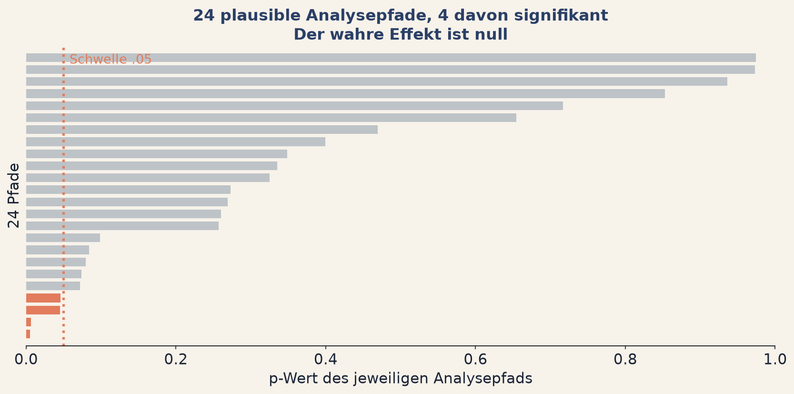
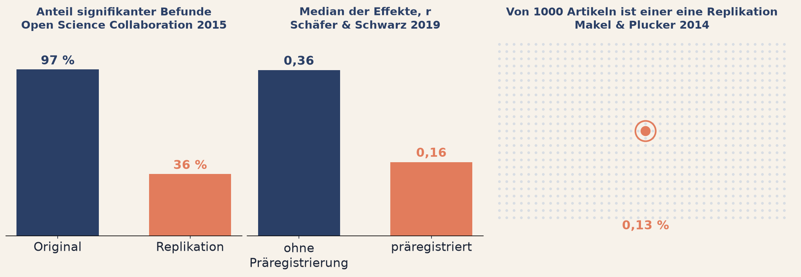
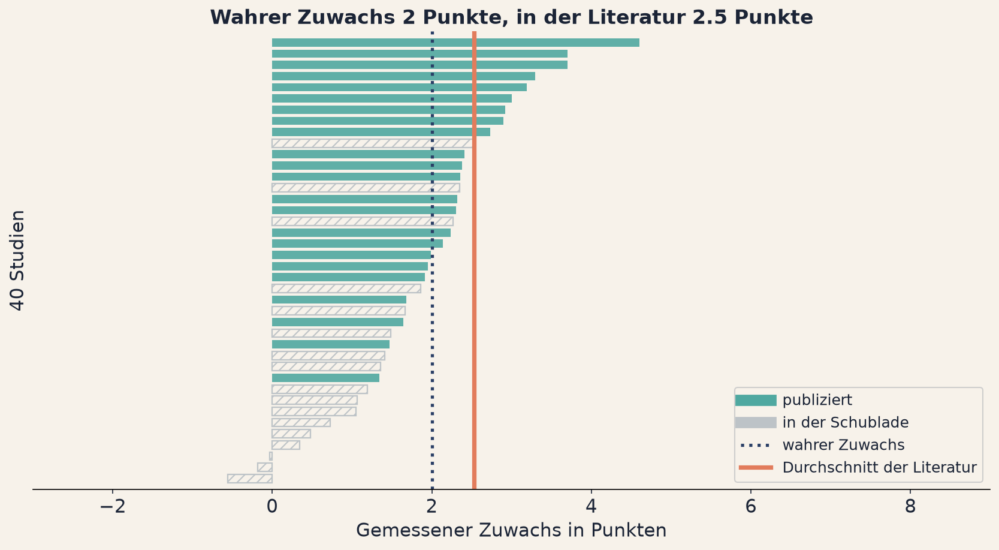

<!--
Verlinkte Seiten dieses Decks, hier zentral pflegen:
  Arbeitsblatt     ../../tag1/e2-freiheitsgrade.html
  App Garten       ../../apps/a03-garten.html
  App Drop-out     ../../apps/a04-dropout.html
  App Publikation  ../../apps/a05-publikationsbias.html
-->

## Fragerunde: Einheit 1 {background-color="#2A3F66"}

[Kurz zusammentragen]{.bp-eyebrow}

::: {.bp-callout}
Zwei Standorte, derselbe Zuwachs, verschiedene Urteile. Woran lag es, und was
hättet ihr stattdessen berichtet?
:::

::: {.bp-runde}
::: {.bp-runde__gruppe}
[1]{.bp-runde__num}
[Gruppe 1]{.bp-runde__label}
:::
::: {.bp-runde__gruppe}
[2]{.bp-runde__num}
[Gruppe 2]{.bp-runde__label}
:::
::: {.bp-runde__gruppe}
[3]{.bp-runde__num}
[Gruppe 3]{.bp-runde__label}
:::
::: {.bp-runde__gruppe}
[4]{.bp-runde__num}
[Gruppe 4]{.bp-runde__label}
:::
::: {.bp-runde__gruppe}
[5]{.bp-runde__num}
[Gruppe 5]{.bp-runde__label}
:::
:::

::: notes
Der Reihe nach, Gruppe 1 bis 5, eine Minute pro Gruppe. Ich sage das vorher an
und halte mich daran, sonst frisst diese Runde die halbe Einheit.

Mit der Tafel arbeiten, Taste b öffnet sie, c ist der Stift. Ich schreibe pro
Gruppe nur ein Stichwort mit. Am Ende steht dort die Sammlung, und die ist der
Übergang zu dieser Einheit.

Die erwartete Bandbreite: die meisten Gruppen kommen auf die Streuung. Wer
weiter ist, nennt das Konfidenzintervall oder sagt, dass beide Standorte
zusammengefasst gehören.

Wenn eine Gruppe nichts hat, nicht bohren. Stattdessen: "Was hat euch am meisten
überrascht?" Darauf hat jede Gruppe eine Antwort.

Mein Schlusssatz nach Gruppe 5, er leitet direkt über: "Bis hierhin war der
p-Wert das Problem. Jetzt schauen wir uns an, was passiert, bevor er überhaupt
berechnet wird."
:::

# Einheit 2 {.bp-trenner background-color="#E27C5C"}

[Tag 1 · Die Diagnose]{.bp-eyebrow}

## Die Freiheitsgrade des Forschens

::: notes
Kurz. Der Titel ist Programm: es geht jetzt nicht mehr um die Kennzahl, sondern
um alles, was vor ihr passiert.
:::

## Welche davon hast du schon einmal getan?

::: {.bp-aufgabe}
1. Nach dem ersten Blick in die Daten noch Fälle nachgetestet.
2. Auffällige Werte entfernt, nachdem du das Ergebnis gesehen hattest.
3. Zwischen zwei Auswertungsvarianten die berichtet, die besser lief.
4. Eine Teilgruppe berichtet, weil im Gesamtbild nichts zu sehen war.
5. Eine Hypothese erst nach der Auswertung so formuliert, wie sie jetzt passt.
:::

::: {.bp-handzeichen}
Handzeichen. Oder auch nicht, das ist gleich gültig.
:::

::: notes
Der heikelste Moment der beiden Tage. Er funktioniert nur, wenn ich zuerst
selbst die Hand hebe. Das mache ich sichtbar und ohne Umschweife.

Der Zusatz "oder auch nicht, das ist gleich gültig" ist wichtig und wird
wörtlich gesagt. Niemand muss sich hier outen.

Danach der entscheidende Satz: keine dieser fünf Handlungen ist Betrug. Jede
einzelne steht so oder so ähnlich in Methodenlehrbüchern. Das Problem entsteht
erst durch die Menge der Möglichkeiten und dadurch, dass die Entscheidung nach
dem Blick in die Daten fällt.

Wenn gar niemand reagiert: umformulieren zu "Welche davon habt ihr schon einmal
in einem Manuskript gelesen, das ihr begutachtet habt?" Das löst die Blockade
zuverlässig.

Rund 3 Minuten.
:::

## Der Garten der sich verzweigenden Pfade

{.bp-abb .bp-abb--knapp}

::: {.bp-callout}
Nicht die einzelne Entscheidung ist das Problem, sondern die **Zahl der
möglichen Entscheidungen**.
:::

::: {.bp-quelle}
Der Titel ist bei Borges geborgt. Bei ihm verzweigt sich der Garten in alle
möglichen Zukünfte gleichzeitig. Beim Auswerten nehmen wir davon genau eine
und nennen sie das Ergebnis.
:::

::: notes
Die wichtigste Folie der Einheit. Langsam.

Die Abbildung erklären, sie trägt den ganzen Inhalt: jeder Balken ist ein
möglicher Analysepfad, aufsteigend nach p-Wert sortiert. Die gepunktete Linie
ist .05. Die korallenroten Balken links davon sind die Pfade, die ein
signifikantes Ergebnis liefern.

Zuerst und deutlich: der wahre Effekt ist null. Jeder rote Balken ist per
Konstruktion ein Fehlalarm. Diesen Satz zweimal sagen, sonst geht er unter.

Dann die Kombinationen benennen, aus denen die 24 Pfade entstehen: Ausreißer
ausschließen ja oder nein, nur vollständig getestete Klassen ja oder nein, nur
Regelklassen ja oder nein, und drei Subgruppen. Zwei mal zwei mal zwei mal
drei.

Vier Entscheidungen. Niemand würde von sich sagen, dass er vier Entscheidungen
zu viel getroffen hat.

Dann jeden Schritt einzeln plausibel machen, und zwar ernsthaft, nicht
ironisch. Auffällige Testwerte zu prüfen ist gute Praxis. Nur vollständig
getestete Klassen auszuwerten ist methodisch sauber. Sich auf Regelklassen
oder eine Jahrgangsstufe zu beschränken ist inhaltlich begründbar.

Konkrete Zahlen für diesen Datensatz, falls jemand nachfragt: der
Ausgangspfad liegt bei p = 0,079. Vier der 24 Pfade sind signifikant, der
niedrigste bei p = 0,005. Alle vier laufen über die Subgruppe
Ganztagsschulen. Die Subgruppenwahl ist also der stärkste Hebel, nicht das
Ausreißer-Häkchen. Das nicht vorweg verraten, die Gruppen sollen es selbst
finden.

Genau das ist der Punkt: es gibt keinen Schritt, an dem jemand etwas falsch
macht. Der Fehler liegt darin, dass die Reihenfolge der Entscheidungen von den
Zwischenergebnissen abhängt.

Den Begriff verborgene Freiheitsgrade hier einführen, er trägt den Rest der
Einheit.

Rund 4 Minuten.
:::

## Kein Randproblem

::: {.bp-stats}
::: {.bp-stat}
[61 %]{.bp-stat__num}
[Falsch-positiv-Rate, wenn übliche fragwürdige Forschungspraktiken
zusammenkommen. QRPs, p-Hacking. *Simmons et al. (2011)*]{.bp-stat__label}
:::
::: {.bp-stat}
[.05]{.bp-stat__num}
[eine willkürliche Schwelle, die zur Trennung von wahr und falsch geworden
ist.]{.bp-stat__label}
:::
::: {.bp-stat}
[2015]{.bp-stat__num}
[verbietet *Basic and Applied Social Psychology* Signifikanztests **und**
Konfidenzintervalle.]{.bp-stat__label}
:::
:::

::: {.bp-quote}
The earth is round (p < .05).

[Jacob Cohen, 1994]{.bp-quote__author}
:::

::: notes
Die drei Zahlen einzeln durchgehen, nicht als Block überfliegen.

61 Prozent: das ist der Wert, den Simmons, Nelson und Simonsohn erreichen, wenn
sie vier übliche Freiheitsgrade kombinieren. Nominal 5 Prozent, faktisch 61.
Genau die Kombination, die die Folie davor gezeigt hat.

.05: kurz erwähnen, dass Fisher die Schwelle als pragmatische Konvention
vorgeschlagen hat, nicht als Naturkonstante. Er selbst hat sie flexibel
gehandhabt.

2015 BASP: das ist der Punkt, an dem die Einheit von Kritik zu Machbarkeit
kippt. Es gibt ein Journal, das seit über zehn Jahren ohne p-Werte publiziert.
Es funktioniert. Das ist keine Theorie.

Das Cohen-Zitat ist der Titel eines Aufsatzes von 1994. Die Pointe: dass die
Erde rund ist, würde niemand mit einem p-Wert belegen wollen.

In der Gruppenarbeit zählt die Anwendung alle Pfade gleichzeitig aus. Das
kündige ich hier an, weil es der stärkste Moment des Nachmittags ist.

Rund 3 Minuten.
:::

## Was am Ende in der Literatur steht

{.bp-abb}

::: {.bp-warn}
Keine dieser Arbeiten wirft jemandem Betrug vor. Sie beschreiben ein System,
das bestimmte Ergebnisse belohnt.
:::

::: notes
Die drei Arbeiten in aufsteigender Unbequemlichkeit vortragen, je ein Panel
der Abbildung, von links nach rechts.

Bei der Open Science Collaboration die Gegenüberstellung 97 zu 36 Prozent
langsam sprechen lassen. Fast alle Originalbefunde waren signifikant, ein gutes
Drittel der Wiederholungen. Und der eigentliche Befund ist die dritte Zahl: die
Effektstärken halbierten sich. Genau das erwartet man, wenn die Literatur
systematisch überschätzt.

Schäfer und Schwarz ist die saubere Gegenprobe und für dieses Publikum
vielleicht das stärkste Argument der Folie. Dieselbe Disziplin, derselbe
Zeitraum, nur der Unterschied zwischen präregistriert und nicht: der mittlere
Zusammenhang fällt von r gleich 0.36 auf 0.16. Die Präregistrierung hat nichts
an der Wirklichkeit geändert, nur an dem, was publiziert wurde.

Makel und Plucker ist der bildungsspezifische Beleg auf dieser Folie und
deshalb der wichtigste für dieses Publikum. Im rechten Panel ist jeder Punkt
ein Artikel, tausend insgesamt, und genau einer davon ist eine Replikation.
Das Bild macht die Arbeit, ich sage nur die Zahl dazu. Man kann in der
Bildungsforschung also gar nicht wissen, wie replizierbar sie ist.

Der zweite Befund dort ist der schärfere und steht bewusst nicht auf der
Folie: Replikationen gelingen deutlich seltener, wenn kein Autor der
Originalstudie beteiligt ist. Wenn also unabhängige Teams nachprüfen, hält
weniger. Wer hier fragt, bekommt diese ehrliche Antwort.

Wenn jemand einwendet, das sei alles Psychologie und nicht übertragbar:
zustimmen, dass die Felder sich unterscheiden, und dann zurückfragen, welcher
der Mechanismen von dieser Folie in der Bildungsforschung nicht vorkommt.
Üblicherweise wird die Liste kurz.

Rund 3 Minuten.
:::

## Wer fehlt, ist keine Zufallsauswahl

**100 Klassen im Programm.** Die Testungen fallen genau dort aus, wo es
schwierig wird: hohe Belastung, Personalmangel, viele Abwesenheiten.

::: {.bp-zwei}
::: {}
Übrig bleiben die **gut ausgestatteten** Schulen. Dort wirkt LeseStark besser.
Der berichtete Effekt wächst, ohne dass sich jemand verrechnet hätte.
:::
::: {.bp-quote}
Die Daten lügen nicht. Sie schweigen nur über die, die nicht mehr da sind.
:::
:::

::: {.bp-callout}
Entscheidend ist nicht, **wie viele** fehlen, sondern **wer**.
:::

::: notes
Roter Faden: fehlende Daten sind eine Information über den Auswahlprozess, nicht
nur ein Loch in der Tabelle.

Das Beispiel ist bewusst absichtslos gewählt. Niemand hat entschieden, welche
Schule herausfällt. Die Belastung hat es entschieden. Genau deshalb fällt es im
Bericht nicht auf.

Übertragung auf die eigene Arbeit sofort anschließen, hier ist das Publikum zu
Hause: Wer nimmt an der freiwilligen Zusatzerhebung nicht teil? Wer bricht die
Testung ab? Welche Schule sagt die Teilnahme kurzfristig ab, und warum
ausgerechnet die?

Die Richtung ist fast immer dieselbe: die Maßnahme sieht besser aus, als sie
ist.

Rund 4 Minuten.
:::

## Drei Mechanismen, drei Konsequenzen

| | Das Fehlen hängt ab von | Rettbar? |
|---|---|---|
| **MCAR** | nichts, reiner Zufall | ja, kostet nur Präzision |
| **MAR** | **beobachteten** Variablen | ja, etwa durch Imputation |
| **MNAR** | den **unbeobachteten** Werten selbst | nein |

::: {.bp-warn}
Unser Fall ist **MNAR**. Das lässt sich nicht wegrechnen, nur offenlegen.
:::

::: notes
Die Tabelle nicht vorlesen. Nur die Trennlinie erklären: MCAR und MAR sind
technische Probleme mit technischen Lösungen. MNAR ist ein inhaltliches
Problem, und dafür gibt es keine Rechnung.

Der praktisch wichtigste Satz: die meisten Verfahren zur Behandlung fehlender
Werte setzen MAR voraus, und diese Annahme ist aus den Daten heraus nicht
prüfbar. Man kann sie nur begründen.

Für dieses Publikum die Brücke schlagen: bei Schulleistungsstudien ist die
Teilnahmeentscheidung selbst oft der Auswahlmechanismus, und sie hängt mit dem
Merkmal zusammen, das gemessen werden soll. Das ist der Lehrbuchfall für MNAR.

Der Zusatz zur Verallgemeinerung steht nicht mehr auf der Folie, gehört aber
gesagt: auch eine vollständige Stichprobe sagt wenig über Gruppen, die im
Design nie vorkamen.

Rund 3 Minuten.
:::

## Publikationsbias: niemand hat gelogen

{.bp-abb}

::: {.bp-callout}
Niemand hat gelogen, und das Bild ist trotzdem verzerrt. Meta-Analysen erben
diese Verzerrung.
:::

::: notes
Roter Faden: die Verzerrung entsteht bei der Auswahl dessen, was publiziert
wird, nicht beim Rechnen.

Der Trick der Darstellung in der Anwendung: man sieht alle 40 Teams, auch die,
die es nie in ein Journal geschafft hätten. Dann zieht man die Publikationslücke
auf und sieht, wie der Mittelwert wegwandert.

Wichtig und ausdrücklich sagen: jede einzelne dieser 40 Studien ist korrekt
gerechnet. Der Fehler steckt in der Auswahl, die wir Literatur nennen.

Für dieses Publikum die Anwendung auf Programmevaluation: eine Maßnahme, die
dreimal evaluiert wurde und zweimal nichts zeigte, erscheint in der Literatur
möglicherweise als einmal wirksam.

Rund 4 Minuten.
:::

## Was dagegen tatsächlich hilft

::: {.bp-drei}
::: {.bp-pillar .tone-teal}
[Diagnose]{.bp-pillar__num}

### Funnel-Plot

Symmetrischer Trichter heißt unverzerrt. Fehlende Ecke heißt Publikationslücke.
:::
::: {.bp-pillar .tone-teal}
[Diagnose]{.bp-pillar__num}

### p-Curve

Häufen sich die p-Werte knapp unter .05, wurde selektiv berichtet.
:::
::: {.bp-pillar .tone-coral}
[Struktur]{.bp-pillar__num}

### Präregistrierung

Analyseplan vor der Erhebung. Bei Registered Reports hängt die Zusage am
Design, nicht am Ergebnis.
:::
:::

::: {.bp-callout}
Präregistrierung verbietet dir nichts. Sie trennt nur **geplant** von
**entdeckt**. Beides ist erlaubt, es muss nur unterscheidbar bleiben.
:::

::: notes
Die drei Karten unterscheiden Diagnose von Struktur. Funnel-Plot und p-Curve
erkennen das Problem im Nachhinein. Präregistrierung verhindert es. Nur das
Zweite löst es wirklich.

Der Kasten unten löst den häufigsten Widerstand auf. Präregistrierung wird als
Fessel wahrgenommen, die exploratives Arbeiten verbietet. Sie tut das nicht, sie
zwingt nur zur Kennzeichnung.

Zur Niederschwelligkeit: bei AsPredicted sind es neun Fragen und unter zehn
Minuten. Der häufigste Grund, es nicht zu tun, ist die Annahme, es sei
aufwendig.

Das ist die kürzbare Folie dieser Einheit. Wenn ich im Verzug bin, sage ich nur
den Kasten und gehe weiter. Die Gruppen kommen morgen ohnehin darauf zurück.

Rund 3 Minuten.
:::

# Jetzt seid ihr dran {.bp-trenner background-color="#4FA8A0"}

[Gruppenarbeit in den Breakout-Räumen]{.bp-eyebrow}

## Gruppenarbeit 2 {background-color="#4FA8A0"}

::: {.bp-aufgabe}
**Stellt euch vor**, ihr wollt dieses Programm durchbekommen. Der wahre Effekt
ist null. Sucht den kleinsten p-Wert, den der Garten hergibt.

**Die Frage für eure Gruppe:** Wie viele Pfade habt ihr gebraucht, und welcher
davon wäre in einem Bericht am wenigsten aufgefallen?
:::

::: {.bp-demo-hinweis}
Alle Aufgaben, Auffrischungen und Lösungen: [Arbeitsblatt Einheit 2](../../tag1/e2-freiheitsgrade.html)
:::

::: notes
Das Wettbewerbselement funktioniert hier besonders gut: welche Gruppe findet den
kleinsten p-Wert? Das ansagen, es erzeugt Energie und passt inhaltlich genau,
weil es die Absurdität der Übung selbst vorführt.

Der zweite Teil der Frage ist der eigentlich wichtige. Welcher Pfad wäre in
einem Bericht nicht aufgefallen? Da wird es unangenehm, und da soll es
unangenehm werden.

Ich gehe zuerst in den Raum, der in Einheit 1 am langsamsten war.

Nach 25 Minuten die Ansage in alle Räume: noch fünf Minuten.

Rund 1,5 Minuten.
:::
