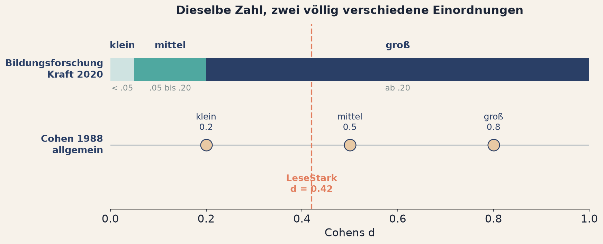
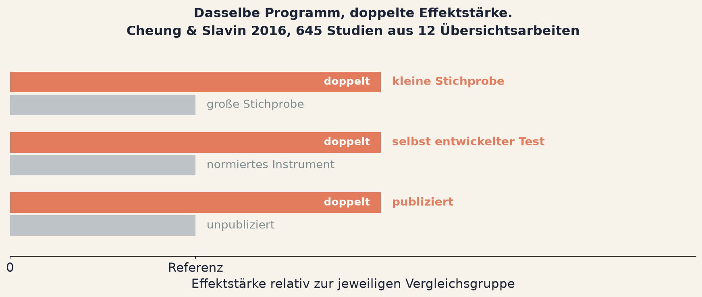
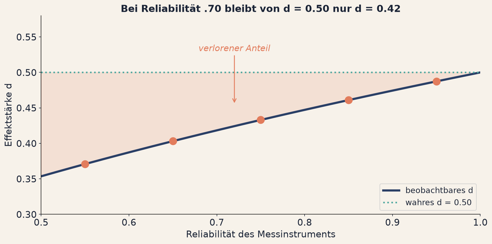

<!--
Verlinkte Seiten dieses Decks, hier zentral pflegen:
  Arbeitsblatt        ../../tag1/e3-effektstaerken.html
  App unstandardisiert ../../apps/a06-rohwerte.html
  App Cohens d        ../../apps/a07-cohens-d.html
  App Relevanz        ../../apps/a08-relevanzschwelle.html
  App Minderung       ../../apps/a09-minderung.html
-->

## Fragerunde: Einheit 2 {background-color="#2A3F66"}

[Kurz zusammentragen]{.bp-eyebrow}

::: {.bp-callout}
Wie viele Pfade habt ihr gebraucht, um unter .05 zu kommen, und welcher davon
wäre in einem Bericht am wenigsten aufgefallen?
:::

::: {.bp-warn}
Ihr habt gezielt gesucht. Der unangenehme Teil: man landet dort auch ohne zu
suchen. Eine Entscheidung nach der anderen, jede plausibel.
:::

::: {.bp-runde}
::: {.bp-runde__gruppe}
[1]{.bp-runde__num}
[Gruppe 1]{.bp-runde__label}
:::
::: {.bp-runde__gruppe}
[2]{.bp-runde__num}
[Gruppe 2]{.bp-runde__label}
:::
::: {.bp-runde__gruppe}
[3]{.bp-runde__num}
[Gruppe 3]{.bp-runde__label}
:::
::: {.bp-runde__gruppe}
[4]{.bp-runde__num}
[Gruppe 4]{.bp-runde__label}
:::
::: {.bp-runde__gruppe}
[5]{.bp-runde__num}
[Gruppe 5]{.bp-runde__label}
:::
:::

::: notes
Die Pfadzahlen auf der Tafel sammeln, das ergibt eine sichtbare Reihe. Taste b
öffnet sie.

Der zweite Teil der Frage ist der wichtige. Hier kommt regelmäßig die
unangenehme Einsicht, dass der unauffälligste Pfad auch der übliche ist. Diesen
Moment nicht überspielen, sondern stehen lassen.

Der Warnkasten ist die Entlastung und gehört gesagt, nicht nur gezeigt.
Niemand im Raum soll sich als Betrüger wiedererkennen. Dieselbe Verzerrung
entsteht bei Leuten, die sorgfältig arbeiten, weil das System diesen Weg
belohnt.

Wenn eine Gruppe sehr wenige Pfade gebraucht hat: fragen, ob sie Glück hatte
oder gesucht hat. Beides ist eine gute Antwort und beides macht denselben Punkt.

Mein Überleitungssatz: "Bis jetzt ging es darum, ob überhaupt etwas da ist.
Jetzt geht es darum, wie viel, und ob wir das überhaupt messen können."
:::

# Einheit 3 {.bp-trenner background-color="#E27C5C"}

[Tag 1 · Die Diagnose]{.bp-eyebrow}

## Effektstärken und ihre Grenzen

::: notes
Kurz. Der Zusatz "und ihre Grenzen" ist der Unterschied zu einem üblichen
Effektstärken-Vortrag. Genau darauf läuft die Einheit hinaus.
:::

## Ist das ein großer Effekt?

::: {.bp-aufgabe}
Eine Evaluation berichtet für LeseStark **d = 0.42**.
:::

::: {.bp-handzeichen}
Handzeichen, wer das für einen großen Effekt hält.
:::

::: {.bp-quelle}
Halte das Ergebnis im Kopf. Wir kommen am Ende dieser Einheit darauf zurück.
:::

::: notes
Bewusst knapp. Die Folie stellt eine Falle, und sie soll sie stellen.

Die ehrliche Antwort lautet: die Frage ist so nicht beantwortbar. Das sage ich
hier aber noch nicht. Ich zähle nur die Hände und notiere die Zahl auf der
Tafel.

Am Ende der Einheit komme ich darauf zurück, dann mit drei Gründen, warum die
Frage unvollständig war: die Einheit fehlt, der Vergleichsmaßstab fehlt, und
die Messgenauigkeit fehlt.

Wenn jemand sofort ruft, dass man das nicht beantworten kann: loben und bitten,
die Begründung noch zwei Folien zurückzuhalten.

Rund 2 Minuten.
:::

## Zuerst die Einheit, dann die Statistik

::: {.bp-quote}
Ein Effekt ist der Unterschied in der interessierenden Variable zwischen Gruppen
oder Bedingungen, oder die Stärke eines Zusammenhangs.

[Er ist die Brücke von der Statistik in die Realität]{.bp-quote__author}
:::

::: {.bp-zwei}
::: {}
**0,4 Punkte oder 6 Punkte?** Der p-Wert unterscheidet die beiden nicht
zuverlässig. Die Förderentscheidung hängt an ihnen.
:::
::: {}
**Zwei Übersetzungen, die sofort wirken:**

- **Hochrechnung** auf einen ganzen Jahrgang.
- **Einzelfall:** Wie viele der Geförderten liegen über dem Median der
  Vergleichsgruppe?
:::
:::

::: {.bp-callout}
Eine Kommission entscheidet nicht über d. Sie entscheidet über Punkte,
Förderstunden und Kosten. Berichte deshalb immer zuerst den
unstandardisierten Effekt.
:::

::: notes
Der Kern: die Einheit ist keine Nebensache, sie ist die Entscheidungsgrundlage.

Baguley (2009) ist hier die Referenz, falls jemand fragt. Sein Argument: die
Standardisierung ist ein Werkzeug für den Vergleich zwischen Studien, nicht für
die Interpretation einer einzelnen Studie.

Für dieses Publikum die konkrete Form: Eine Kommission entscheidet nicht über
d. Sie entscheidet über Punkte, Förderstunden und Kosten.

Die Einzelfall-Übersetzung ist der Teil, den die Teilnehmenden am ehesten
mitnehmen. Sie bekommt am Ende der Einheit als CLES eine eigene Folie.

Rund 4 Minuten.
:::

## Was d leistet

$$d = \frac{|M_1 - M_2|}{SD}$$

::: {.bp-zwei}
::: {.bp-pillar .tone-coral}
[Aspekt 01]{.bp-pillar__num}

### Entdeckbarkeit

5 Punkte bei **SD = 2** sind ein klares Signal. Dieselben 5 Punkte bei
**SD = 20** verschwinden im Rauschen.
:::
::: {.bp-pillar .tone-teal}
[Aspekt 02]{.bp-pillar__num}

### Vergleichbarkeit

**Kurzform** 1 bis 5, **+0,50** Punkte. **Vollform** 0 bis 100, **+10** Punkte.
Verschiedene Skalen, identisches d.
:::
:::

::: {.bp-callout}
Genau deshalb existiert d. Der Preis: Punkte kann man einer Kommission
erklären, d nicht.
:::

::: notes
Zuerst die Formel entschärfen: das ist eine Division, mehr nicht. Das laut zu
sagen entspannt spürbar.

Aspekt 1 erklärt, warum d sinkt, wenn die Streuung steigt, obwohl sich am
Effekt nichts ändert. Das ist genau der Mechanismus aus Einheit 1, jetzt in
einer Kennzahl.

Aspekt 2 ist für dieses Publikum der relevantere. Zwei Instrumente für
dieselbe Kompetenz mit verschiedener Skalierung sind ohne Standardisierung
nicht vergleichbar. Das ist Alltag in der Bildungsforschung.

In der Anwendung lässt sich d frei einstellen, und die beiden Rohwerte
bewegen sich mit. Bei d = 0.50 sind es +0,50 auf der Kurzform und +10 auf der
Vollform.

Der Preis ist die Pointe und die Überleitung: Punkte kann man einer Kommission
erklären, d nicht.

Rund 4 Minuten.
:::

## Die Faustregeln sind kein Kriterium

{.bp-abb .bp-abb--knapp}

::: {.bp-warn}
Aus p < .05 wird d > 0.5. Das Ritual hat nur die Kleider gewechselt.
:::

::: {.bp-quelle}
Kraft (2020), *Interpreting Effect Sizes of Education Interventions*,
Educational Researcher. Dazu Schäfer & Schwarz (2019).
:::

::: notes
Der Satz, der sitzen muss: wer nur Cohens Faustregel benutzt, hat das Ritual
ersetzt, nicht überwunden. Aus p < .05 wird d > 0.5, und die Denkarbeit bleibt
dieselbe, nämlich keine.

Der bessere Maßstab ist die empirische Verteilung im eigenen Feld. Schäfer und
Schwarz liefern die, und der Aufwand ist gering: einmal nachschauen, was in
vergleichbaren Studien gefunden wurde.

Cohen selbst hat die Werte ausdrücklich als Notlösung für den Fall bezeichnet,
dass gar nichts Besseres verfügbar ist.

Rund 3 Minuten.
:::

## Woran Effektstärken tatsächlich hängen

{.bp-abb}

::: {.bp-callout}
Wer zwei Effektstärken vergleicht, vergleicht immer auch zwei Designs.
Ranglisten von Maßnahmen könnten deshalb Ranglisten der **Manipulierbarkeit
von Designs** sein. *Simpson (2017)*
:::

::: notes
Die inhaltlich wichtigste Belegfolie des Workshops, weil sie direkt in die
Arbeit dieses Publikums greift.

Die Abbildung zuerst lesen: je Zeile ein Merkmal des Designs. Der graue Balken
ist die Vergleichsgruppe, der korallenrote die Studien mit diesem Merkmal. In
allen drei Zeilen ist er doppelt so lang. Die Skala ist bewusst relativ, weil
die Quelle ein Verhältnis berichtet und keine absoluten Paare.

Was nicht im Bild steht und dazugehört: Quasi-Experimente liefern höhere Werte
als randomisierte Studien.

Cheung und Slavin zuerst, und zwar mit der praktischen Konsequenz: wenn eine
kleine Studie mit selbst gebautem Test ein doppelt so großes d liefert wie eine
große Studie mit normiertem Instrument, ist das kein Hinweis darauf, dass die
Maßnahme dort besser wirkt. Es ist ein Hinweis auf das Design.

Das ist der Moment, an dem oft die Hattie-Frage kommt. Wenn sie kommt, nehme ich
sie an und antworte mit Simpsons Formulierung: solche Ranglisten könnten
Ranglisten der Manipulierbarkeit von Designs sein statt Ranglisten der
Wirksamkeit. Das Problem ist nicht, Effektstärken zu sammeln, sondern sie aus
völlig verschiedenen Designs in eine Rangfolge zu schreiben.

Kraft ist die konstruktive Wendung. Er sagt nicht, dass Effektstärken nutzlos
sind, sondern dass sie feldspezifische Maßstäbe brauchen.

Ehrlichkeitshalber dazu, falls jemand tief im Thema steckt: Kraft ist nicht
unwidersprochen. Simpson hat 2023 in derselben Zeitschrift unter dem Titel
*Benchmarking a Misnomer* dagegen argumentiert. Wenn das im Raum aufkommt, ist
die Antwort: die Debatte läuft, und schon dass sie läuft, ist der Punkt dieser
Folie.

Rund 4 Minuten.
:::

## Und dann misst du auch noch ungenau

$$d_{\text{beobachtet}} = d_{\text{wahr}} \cdot \sqrt{\text{Rel}}$$

{.bp-abb}

::: {.bp-warn}
Das **d = 0.42** aus Einheit 1 ist bei Reliabilität .70 genau das, was ein
wahrer Effekt von **0.50** übrig lässt.
:::

::: notes
Das ist die Folie, wegen der diese Einheit anders aussieht als ein üblicher
Effektstärken-Vortrag. Hier langsam werden.

Die Abbildung zuerst lesen: waagerecht die Reliabilität des Instruments,
senkrecht die Effektstärke. Die türkise gepunktete Linie ist das wahre d von
0.50, die dunkle Kurve das, was man davon messen kann. Die rot schattierte
Fläche dazwischen ist der Anteil, der in der Messung verloren geht.

Die fünf roten Punkte auf der Kurve sind die Reliabilitäten, die die Gruppen
gleich bekommen. Das kurz ankündigen, dann wissen sie später, wo sie stehen.

Der Rückgriff auf Einheit 1 ist der Clou. Dieselbe Zahl, 0.42, die wir vorhin
noch für den Effekt gehalten haben, ist in Wahrheit der Schatten eines größeren
Effekts, gedämpft durch die Messung.

Drei Punkte, die sitzen müssen:

Erstens, die Richtung ist immer dieselbe. Unzuverlässige Messung macht Effekte
kleiner, nie größer. Wer also bei schlechter Reliabilität einen Effekt findet,
hat eher einen starken Effekt als einen schwachen.

Zweitens, mehr Fälle helfen nicht. Ein größeres n macht die Schätzung präziser,
aber sie konvergiert gegen den gedämpften Wert, nicht gegen den wahren.
Reliabilität ist eine Obergrenze, kein Rauschen.

Drittens, die Konsequenz für die Planung: Investition in ein besseres
Messinstrument kann mehr bringen als Investition in mehr Fälle. Für dieses
Publikum ist das der praktisch wertvollste Satz des Tages.

Falls jemand nach der Minderungskorrektur fragt: ja, man kann nach oben
korrigieren, und ja, das ist umstritten, weil die Korrektur die
Reliabilitätsschätzung mitschleppt. Berichten sollte man beides, korrigiert und
unkorrigiert.

Baguley (2009) nennt die Reliabilität ausdrücklich als einen der Faktoren, die
standardisierte Effektstärken verzerren, neben eingeschränkter Varianz und
Designunterschieden. Das ist die Literaturstelle, falls jemand eine will.

Eine Einschränkung, die ich von mir aus nennen sollte: die Anwendung modelliert
nur Unreliabilität im **Ergebnismaß**. Messfehler in der Gruppenzuordnung
wären eine eigene Korrektur und sind hier nicht abgebildet. Wer das anspricht,
hat recht, und die Antwort lautet: bewusst weggelassen, weil der Punkt schon
mit einer Fehlerquelle ankommt.

Falls jemand nach Korrelationen fragt: dort werden beide Variablen gedämpft,
die Wurzel steht dann über dem Produkt beider Reliabilitäten.

Rund 5 Minuten. Nicht kürzen, das ist der Kern der Einheit.
:::

## Ein Maß, das niemand erklären muss

::: {.bp-quote}
In 71 % der Vergleiche liegt die geförderte Person vorn.

[CLES, dasselbe wie d = 0.8]{.bp-quote__author}
:::

::: {.bp-callout}
Beide Sätze beschreiben denselben Befund. Nur einer davon übersteht eine
Kommissionssitzung.
:::

::: {.bp-quelle}
Die übrigen Maße, von Hedges' g bis zum Odds Ratio, stehen zum Nachschlagen
auf dem Arbeitsblatt.
:::

::: notes
Die Tabelle ist bewusst von der Folie verschwunden und steht jetzt aufklappbar
auf dem Arbeitsblatt. Hier stattdessen fragen, welche Maße die Anwesenden
tatsächlich berichten, und nur die besprechen.

CLES ist der Punkt, der am meisten mitgenommen wird. Es übersetzt ein
standardisiertes Maß in eine Aussage über Einzelfälle, und genau das wollen
Praxis, Ministerien und Öffentlichkeit hören.

Bei Odds Ratio kurz warnen: sie werden systematisch als Risiken fehlgelesen. Bei
häufigen Ereignissen liegen OR und RR weit auseinander.

Das ist die kürzbare Folie dieser Einheit.

Rund 3 Minuten.
:::

## So berichtest du es

::: {.bp-aufgabe}
**Der Minimalstandard für jeden Ergebnissatz:**

1. **Unstandardisiert**, in der Einheit der Sache. *2,1 Punkte im Lesetest.*
2. **Standardisiert**, für die Einordnung. *d = 0.42.*
3. **Ein Intervall**, immer. *95 % CI [0.18, 0.66]*.
4. **Die Reliabilität des Instruments.** *α = .70.*
5. **Ein Vergleich mit dem Feld**, nicht mit Cohens Faustregel.
:::

::: {.bp-warn}
**Was Nummer 3 leistet, und was nicht.** Das Intervall zeigt genau das, was
der p-Wert verschweigt: wie groß der Effekt ist und wie genau du ihn kennst.
Ein breites Intervall ist kein Makel, sondern ein ehrliches Eingeständnis.
Nur die eine Auskunft, die du eigentlich willst, gibt es nicht dazu.
:::

::: {.bp-callout}
Zurück zur Eingangsfrage: **Ist d = 0.42 ein großer Effekt?** Die Frage war
nicht beantwortbar. Es fehlten die Einheit, der Vergleichsmaßstab und die
Messgenauigkeit.
:::

::: notes
Die praktisch nützlichste Folie des ganzen Tages. Hier darf man langsam werden.

Punkt 4 ist der, den ich gegenüber dem üblichen Standard ergänzt habe, und er
folgt direkt aus der Minderungsfolie. Ohne Reliabilitätsangabe ist eine
Effektstärke nicht interpretierbar.

Punkt 5 fehlt am häufigsten und macht am wenigsten Arbeit.

Beim Warnkasten kurz innehalten, das ist die einzige Stelle an Tag 1, an der
das Konfidenzintervall etwas Raum bekommt. Zwei Sätze reichen: es zeigt
Effektgröße und Präzision, und ein breites Intervall ist eine ehrliche
Auskunft, kein Versagen.

Den letzten Satz bewusst offen lassen und **nicht** auflösen. Wer nachhakt,
welche Auskunft denn fehlt, bekommt: genau die, die heute Nachmittag im Quiz
als Nummer 7 stand. Morgen. Das ist derselbe
Cliffhanger wie in Einheit 1 und er wird hier nur nachgezogen, nicht
aufgelöst.

Dann der Rückgriff auf die Eingangsfrage. Die Zahl der Hände von vorhin steht
noch auf der Tafel. Darauf zeigen und auflösen. Das schließt die Einheit als
Bogen und ist der stärkste mögliche Schluss.

Rund 2,5 Minuten.
:::

# Jetzt seid ihr dran {.bp-trenner background-color="#4FA8A0"}

[Gruppenarbeit in den Breakout-Räumen]{.bp-eyebrow}

## Gruppenarbeit 3 {background-color="#4FA8A0"}

::: {.bp-aufgabe}
**Die Frage für eure Gruppe:** Jede Gruppe bekommt eine andere Reliabilität
zugewiesen. Berichtet, welcher wahre Effekt hinter eurem beobachteten d steckt,
und was ihr der Kommission empfehlen würdet: mehr Fälle oder ein besserer Test?
:::

::: {.bp-demo-hinweis}
Alle Aufgaben, Auffrischungen und Lösungen: [Arbeitsblatt Einheit 3](../../tag1/e3-effektstaerken.html)
:::

::: notes
Die Zuweisung der Reliabilitäten steht auf dem Arbeitsblatt: Gruppe 1 bekommt
.95, Gruppe 2 .85, Gruppe 3 .75, Gruppe 4 .65, Gruppe 5 .55.

Das ist bewusst so gebaut: in der Fragerunde setzt sich aus den fünf Antworten
die Minderungskurve zusammen, die sonst niemand gesehen hätte. Ich zeichne sie
auf der Tafel mit, während die Gruppen berichten.

Das ansagen, es motiviert. Jede Gruppe liefert einen Punkt, den keine andere
hat.

Der zweite Teil der Frage, mehr Fälle oder besserer Test, ist die Transferfrage.
Die Antwort ist nicht immer dieselbe, sie hängt davon ab, wo die Gruppe
startet. Genau deshalb sind die Reliabilitäten verteilt.

Nach 25 Minuten die Ansage: noch fünf Minuten.

Rund 1,5 Minuten.
:::
