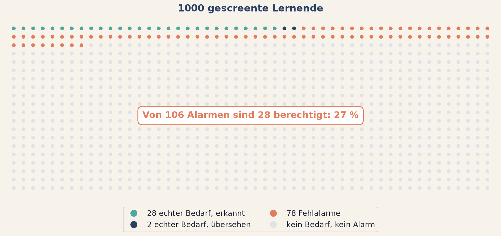

<!--
Verlinkte Seiten dieses Decks, hier zentral pflegen:
  Arbeitsblatt     ../../tag2/e4-bayes-denken.html
  App zwei Welten  ../../apps/a10-zwei-welten.html
  App Screening    ../../apps/a11-screening.html
  App Bruecke      ../../apps/a12-p-und-posterior.html
-->

# Einheit 4 {.bp-trenner background-color="#2A3F66"}

[Tag 2 · Die Alternative]{.bp-eyebrow}

## Die Frage umdrehen

::: notes
Kurz stehen lassen. Ab hier wird gebaut statt kritisiert.
:::

## Ein Screening schlägt an. Wie sicher ist das?

Ein Verfahren screent auf **Leseförderbedarf im engeren Sinne**.

| | |
|---|---|
| Anteil in der Population | **3 %** |
| Erkennungsrate bei echtem Bedarf | **95 %** |
| Fehlalarmrate ohne Bedarf | **8 %** |

::: {.bp-handzeichen}
Handzeichen in Bändern: über 90 %, zwischen 50 und 90 %, unter 50 %.
:::

::: notes
Der stärkste Einzeleffekt, den man in einem Statistik-Workshop erzeugen kann.
Deshalb steht er am Anfang von Tag 2.

Ablauf genau so: erst die drei Zahlen zeigen, dann in Bändern abstimmen lassen,
über 90, zwischen 50 und 90, unter 50. Jedes Band einzeln abfragen und laut
mitzählen.

Die Mehrheit landet zu hoch, regelmäßig im obersten Band. Die Zahlen auf der
Tafel notieren, ich brauche sie gleich für die Auflösung.

Noch nicht auflösen. Das passiert zwei Folien weiter, und der Abstand dazwischen
ist Absicht.

Wenn jemand die Antwort schon kennt und ruft: bitten, kurz zu warten, und
danach fragen, wie er oder sie es gerechnet hat. Das ist die beste
Überleitung, die es gibt.

Rund 4 Minuten.
:::

## Zwei Welten der Wahrscheinlichkeit

::: {.bp-zwei}
::: {.bp-pillar .tone-sand}
[Frequentistisch]{.bp-pillar__num}

### Grenzwert relativer Häufigkeiten

Wahrscheinlichkeit ist der Grenzwert relativer Häufigkeiten bei unendlich vielen
Wiederholungen.

Aussagen gelten über **Verfahren**, nicht über einzelne Fälle.
:::
::: {.bp-pillar .tone-navy}
[Bayesianisch]{.bp-pillar__num}

### Grad der Überzeugung

Wahrscheinlichkeit ist ein Maß für den Grad der Überzeugung, gegeben den
aktuellen Informationsstand.

Aussagen gelten über **Hypothesen**.
:::
:::

::: {.bp-warn}
Ein 95-%-Konfidenzintervall bedeutet **nicht**, dass der wahre Wert mit 95 %
Wahrscheinlichkeit darin liegt. Es beschreibt die langfristige Erfolgsquote des
Verfahrens. Das war Fehlannahme Nummer 7 von gestern.
:::

::: notes
Beide Definitionen wörtlich bringen, sie sind präzise formuliert.

Der Warnkasten ist der wichtigste Satz der Folie. Er löst den Cliffhanger von
gestern ein, Fehlannahme Nummer 7. Das ausdrücklich sagen, die Gruppe erinnert
sich.

Die Pointe: die Aussage, die wir intuitiv über ein Konfidenzintervall machen
wollen, ist nicht falsch als Gedanke. Sie ist nur die falsche Aussage für
dieses Werkzeug. Es gibt ein Werkzeug, das genau diese Aussage erlaubt, und das
kommt morgen nicht, sondern in der nächsten Einheit.

Wichtig für den Ton: das ist kein Lagerkampf. Es sind zwei verschiedene Fragen,
nicht eine bessere und eine schlechtere Methode. Wer das anders darstellt,
verliert die Hälfte des Raums.

Rund 4 Minuten.
:::

## Das Bayes-Theorem

$$P(\theta \mid D) = \frac{P(D \mid \theta)\, P(\theta)}{P(D)}$$

| Teil | Bedeutung |
|---|---|
| **Prior** $P(\theta)$ | was du vorher geglaubt hast |
| **Likelihood** $P(D \mid \theta)$ | wie gut die Hypothese zu diesen Daten passt |
| **Evidenz** $P(D)$ | der Nenner, der alles auf eins normiert |
| **Posterior** $P(\theta \mid D)$ | was du danach glaubst |

::: {.bp-callout}
Eine Anleitung, aus neuen Informationen klüger zu werden. Mehr steht da nicht.
:::

::: notes
Die Tabelle Zeile für Zeile, bei jeder eine Sekunde Pause. Diese vier Begriffe
tragen den ganzen Rest des Tages, sie bekommen morgen keine zweite Chance.

Die Evidenz im Nenner ist die Zeile, bei der Leute aussteigen. Kurzform: sie
normiert, damit am Ende eine Wahrscheinlichkeitsverteilung herauskommt, die
sich zu eins aufsummiert. In Einheit 6 ist genau dieser Nenner das Problem, das
MCMC löst. Hier schon ankündigen, dann ist es später keine Überraschung.

Wer die Formel abschreckend findet, dem sage ich: die Formel ist die
Buchführung. Das Denken passiert beim Prior und bei der Likelihood, und beides
schauen wir uns in der nächsten Einheit einzeln an.

Rund 5 Minuten.
:::

## Die Auflösung, in Häufigkeiten

{.bp-abb}

::: {.bp-callout}
Die Intuition sagt über 90 %. Der Test ist auch wirklich gut. Die
**Basisrate** ist davon nur leider unbeeindruckt.
:::

::: notes
Die Auflösung. Zuerst auf die Zahlen von der Tafel zeigen, die der Raum vorhin
geschätzt hat. Der Kontrast macht die Arbeit.

Die Abbildung erklären: jeder Punkt ist eine Person, tausend insgesamt.
Türkis sind die 28 mit echtem Bedarf, die das Screening findet. Dunkelblau
sind die 2, die es übersieht. Korallenrot sind die 78 Fehlalarme. Der graue
Rest hat keinen Bedarf und schlägt auch nicht an.

Der Trick der Darstellung: man sieht auf einen Blick, dass die rote Gruppe
fast dreimal so groß ist wie die türkise. Dafür braucht niemand eine Formel.

Das ist das Prinzip der Faktenboxen. Absolute Häufigkeiten statt Prozente,
weil Prozente bei bedingten Wahrscheinlichkeiten fast alle Menschen in die
Irre führen, Fachleute eingeschlossen.

Die Rechnung in absoluten Häufigkeiten führen, nicht in Prozent. In Prozent
versteht sie fast niemand, in absoluten Zahlen fast jeder. Das ist genau das
Prinzip der Faktenboxen, und es ist der praktisch nützlichste Trick des ganzen
Tages für die Kommunikation von Befunden.

Für dieses Publikum die Übertragung sofort anschließen, sie liegt nahe:
Screening auf Hochbegabung, auf Förderbedarf, auf Risikolagen. Überall wo das
Merkmal selten ist, produziert auch ein sehr guter Test überwiegend
Fehlalarme. Das hat unmittelbare Konsequenzen für Diagnostik und
Ressourcenzuweisung.

Und der Bezug zurück: die 3 Prozent sind der Prior. Die Erkennungsrate ist die
Likelihood. Die 27 Prozent sind der Posterior. Die Formel von der Folie davor
ist gerade angewandt worden, ohne dass jemand gerechnet hat.

Rund 5 Minuten.
:::

## Dieselben Daten, zwei Auswertungen

**LeseStark, Standort Nord.** 45 Lernende je Gruppe, Zuwachs 2,1 Punkte,
SD rund 5.

::: {.bp-zwei}
::: {.bp-pillar .tone-sand}
[Frequentistisch]{.bp-pillar__num}

### p = .047

95 % CI [0,0; 4,2]

**Sagen darfst du:** Ohne Effekt wären Daten wie diese überraschend.
:::
::: {.bp-pillar .tone-navy}
[Bayesianisch]{.bp-pillar__num}

### P(Effekt > 0) = 98 %

95 % HDI [0,0; 4,2]

**Sagen darfst du:** Das Programm wirkt mit 98 % Wahrscheinlichkeit. Um mehr
als 3 Punkte allerdings nur mit 20 %.
:::
:::

::: {.bp-callout}
Dasselbe Intervall, zwei Sätze. Nur der rechte beantwortet die Frage, die
jemand gestellt hat.
:::

::: notes
Die Brücke zwischen den beiden Tagen und die vielleicht wichtigste Folie des
Workshops. Hier langsam werden.

Zuerst darauf hinweisen, dass die Intervalle bei flachem Prior fast identisch
sind. Das ist kein Zufall und kein Trick, das ist der Normalfall bei
schwacher Vorinformation. Wer erwartet hat, dass Bayes andere Zahlen liefert,
irrt sich.

Der Unterschied liegt nicht in den Zahlen, er liegt in dem, was man sagen darf.
Die beiden Sätze nebeneinander vorlesen und die Gruppe entscheiden lassen,
welchen eine Kommission hören will.

Der zweite Teil des rechten Satzes ist der eigentliche Gewinn: eine Aussage über
die Relevanzschwelle. Genau die lässt sich frequentistisch nicht formulieren,
und genau danach fragt jede Praxisentscheidung. Die 3 Punkte sind dieselbe
Schwelle, die uns in Einheit 6 wieder begegnet.

Wenn jemand einwendet, dass 98 Prozent und ein p von .047 doch dasselbe seien:
ernst nehmen. Zahlenmäßig hängen sie bei flachem Prior zusammen. Inhaltlich
sind es verschiedene Aussagen, und nur eine davon lässt sich über einen
einzelnen Befund treffen.

Rund 4 Minuten.
:::

## Gleich seht ihr es live

In der Anwendung liegen beide Auswertungen nebeneinander. Verändern lassen sich
Stichprobengröße, beobachteter Unterschied und Streuung.

::: {.bp-callout}
Achte darauf, wann die beiden Seiten auseinanderlaufen und wann nicht. Es gibt
Konstellationen, in denen sie dasselbe sagen, und solche, in denen sie sich
widersprechen.
:::

::: {.bp-demo-hinweis}
Anwendung: **p-Wert und Posterior nebeneinander** · [zum Selbstausprobieren](../../apps/a12-p-und-posterior.html)
:::

::: notes
Diese Folie kauft die Ladezeit. Ich rede hier mindestens 45 Sekunden, während
der Tab mit der Anwendung schon offen ist.

Vor der Sitzung alle drei Anwendungen dieser Einheit einmal geladen haben.

In der Demo nur eine Sache zeigen: n hochziehen und beobachten, dass der p-Wert
gegen null rennt, während die Posterior-Wahrscheinlichkeit für einen relevanten
Effekt fast stehen bleibt. Das ist der Punkt von gestern in neuer Form.

Wenn die Anwendung nicht lädt: die Folie davor enthält alle Zahlen, die für den
Punkt nötig sind.

Das ist die kürzbare Folie dieser Einheit.

Rund 2 Minuten, plus die Demo selbst.
:::

# Jetzt seid ihr dran {.bp-trenner background-color="#4FA8A0"}

[Gruppenarbeit in den Breakout-Räumen]{.bp-eyebrow}

## Gruppenarbeit 4 {background-color="#4FA8A0"}

::: {.bp-aufgabe}
**Die Frage für eure Gruppe:** Ihr habt an der Basisrate, der Erkennungsrate und
der Fehlalarmrate gedreht. Welcher der drei Regler ist der wichtigste, und was
folgt daraus für ein Screening in eurem eigenen Arbeitsfeld?
:::

::: {.bp-demo-hinweis}
Alle Aufgaben, Auffrischungen und Lösungen: [Arbeitsblatt Einheit 4](../../tag2/e4-bayes-denken.html)
:::

::: notes
Diese Gruppenarbeit ist die längste des Workshops, 32 Minuten. Der Grund: für
die meisten ist Bayes neu, und die Basisraten-Anwendung braucht Zeit, bis die
Intuition kippt.

Auf dem Arbeitsblatt stehen die Auffrischungen zu bedingter Wahrscheinlichkeit
und zum Bayes-Theorem direkt bei den Aufgaben, aufklappbar. Das ansagen, es
nimmt Druck von denen, die gestern nicht dabei waren.

Die zweite Teilfrage ist der Transfer und der eigentliche Ertrag. Jede Gruppe
hat jemanden dabei, der mit Diagnostik zu tun hat.

Ich gehe nach fünf Minuten durch alle Räume. Bei dieser Anwendung ist die
häufigste Hürde, dass Gruppen zu schnell an mehreren Reglern gleichzeitig
drehen. Dann sage ich: ein Regler, dann schauen, dann der naechste.

Nach 27 Minuten die Ansage: noch fünf Minuten.

Rund 1,5 Minuten.
:::
