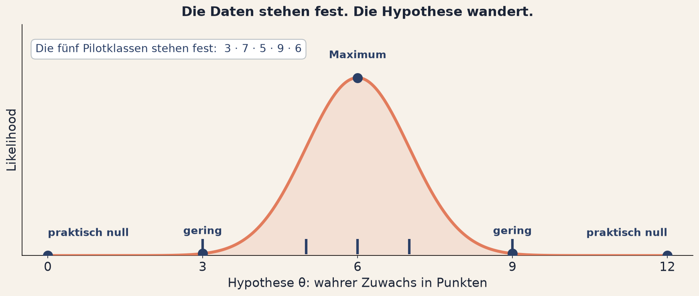
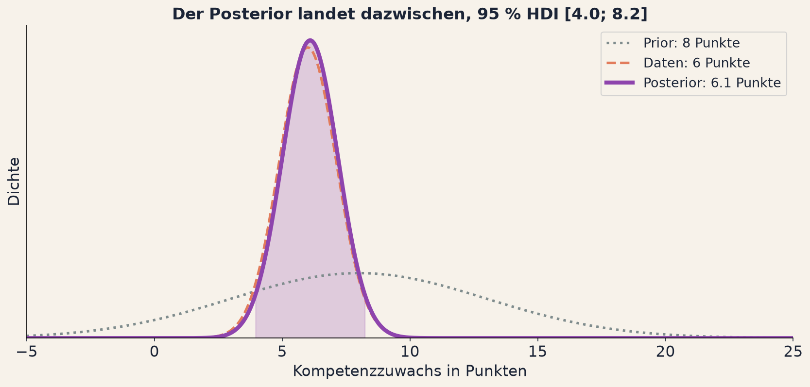

<!--
Verlinkte Seiten dieses Decks, hier zentral pflegen:
  Arbeitsblatt    ../../tag2/e5-prior-likelihood-posterior.html
  App Prior       ../../apps/a13-prior.html
  App Likelihood  ../../apps/a14-likelihood.html
  App Posterior   ../../apps/a15-posterior.html
-->

## Fragerunde: Einheit 4 {background-color="#2A3F66"}

[Kurz zusammentragen]{.bp-eyebrow}

::: {.bp-callout}
Welcher der drei Regler war der wichtigste, und was folgt daraus für ein
Screening in eurem eigenen Arbeitsfeld?
:::

::: {.bp-runde}
::: {.bp-runde__gruppe}
[1]{.bp-runde__num}
[Gruppe 1]{.bp-runde__label}
:::
::: {.bp-runde__gruppe}
[2]{.bp-runde__num}
[Gruppe 2]{.bp-runde__label}
:::
::: {.bp-runde__gruppe}
[3]{.bp-runde__num}
[Gruppe 3]{.bp-runde__label}
:::
::: {.bp-runde__gruppe}
[4]{.bp-runde__num}
[Gruppe 4]{.bp-runde__label}
:::
::: {.bp-runde__gruppe}
[5]{.bp-runde__num}
[Gruppe 5]{.bp-runde__label}
:::
:::

::: notes
**Faden.** Davor: die Gruppen haben an Basisrate, Erkennungsrate und
Fehlalarmrate gedreht, dann Pause. Hier: zusammentragen, welcher Regler zählt.
Überleitung: "Ihr habt gerade mit einem Prior gearbeitet, ohne dass ich das
Wort benutzt habe. Die Basisrate war der Prior. Jetzt schauen wir ihn uns
richtig an."

Die Antwort auf den ersten Teil ist fast immer die Basisrate, und das ist
richtig. Deshalb liegt der Ertrag im zweiten Teil.

Auf der Tafel zwei Spalten führen: Anwendungsfeld links, Konsequenz rechts. Am
Ende steht dort eine Liste, die die Gruppe selbst erzeugt hat.

Wenn mehrere Gruppen dasselbe Feld nennen: nach dem Unterschied fragen. Bei
Hochbegabungsdiagnostik und Förderbedarfsdiagnostik sind die Basisraten
verschieden, und das ändert die Antwort.

Überleitungssatz: "Ihr habt gerade mit einem Prior gearbeitet, ohne dass ich
das Wort benutzt habe. Die Basisrate war der Prior. Jetzt schauen wir ihn uns
richtig an."
:::

# Einheit 5 {.bp-trenner background-color="#2A3F66"}

[Tag 2 · Die Alternative]{.bp-eyebrow}

## Prior, Likelihood, Posterior

::: notes
**Faden.** Davor: die Fragerunde hat die Basisrate als Prior entlarvt. Hier:
der Titel nennt die drei Zutaten, die die Einheit abarbeitet. Überleitung:
"Und wir fangen mit der an, die den meisten Ärger macht."

Kurz. Drei Zutaten, eine pro Block.
:::

## Ist ein Prior unwissenschaftlich?

::: {.bp-aufgabe}
Der häufigste Einwand gegen bayesianische Verfahren lautet: **"Der Prior ist
subjektiv, damit kann ich mir das Ergebnis backen."**
:::

::: {.bp-handzeichen}
Handzeichen, wer diesen Einwand schon einmal gehört oder selbst gemacht hat.
:::

::: notes
**Faden.** Davor: der Titel kündigt Prior, Likelihood und Posterior an. Hier:
der Standardeinwand gegen den Prior, abgefragt per Handzeichen und bewusst
nicht sofort beantwortet. Überleitung: "Ich lasse den Einwand stehen und
zeige euch erst, was ein Prior überhaupt ist."

Die Hände gehen fast vollständig hoch, und das ist gut so. Der Einwand ist
verbreitet, er ist ernst gemeint, und er ist teilweise berechtigt.

Ich nehme ihn hier ausdrücklich an und löse ihn nicht sofort auf. Der Satz:
"Der Einwand ist gut. Er stimmt sogar, nur nicht so, wie er gemeint ist. Am
Ende dieser Einheit habt ihr die Antwort darauf."

Wenn jemand den Einwand ausführen will: gern, aber auf zwei Sätze begrenzen und
auf das Ende der Einheit vertagen. Sonst kippt die Einheit in eine Debatte,
bevor die Begriffe stehen.

Rund 2 Minuten.
:::

## Der Prior: uninformativ ist nicht neutral

Der Prior beschreibt, welche Werte du **vor** den neuen Daten für plausibel
hältst.

::: {.bp-zwei}
::: {}
**Uninformativ.** Alle Werte gleich plausibel.

**Informativ.** Nutzt Vorwissen, um Unsinn auszuschließen.

**Schwach informativ.** Der Mittelweg: schließt Unsinn aus, lässt den Daten
den Rest.
:::
::: {.bp-callout}
Der Prior erfindet keine Annahmen. Er macht die Annahmen, die ohnehin da sind,
sichtbar und dadurch angreifbar.
:::
:::

::: {.bp-warn}
Ein flacher Prior hält einen Zuwachs von **30 Punkten** für genauso plausibel
wie einen von 2, auf einem Test mit einer Streuung von 5. Das ist keine
Neutralität. Das ist Leichtgläubigkeit mit Formel.
:::

::: notes
**Faden.** Davor: der Vorwurf, der Prior sei subjektiv. Hier: die erste
Hälfte der Antwort, denn auch der scheinbar neutrale Prior behauptet etwas.
Überleitung: "So viel zur ersten Zutat. Die zweite ist die, die die Daten
einbringen."

Die zentrale Einsicht der Einheit: uninformativ ist nicht neutral.

Das 30-Punkte-Argument ist stark und konkret, deshalb steht es hier. Ein flacher
Prior behauptet, ein Zuwachs von 30 Punkten sei genauso plausibel wie einer von
2. Bei einer Streuung von 5 Punkten wäre das ein d von 6. Das ist keine
Neutralität, das ist eine Behauptung, und zwar eine offensichtlich falsche.

Für dieses Publikum die Anschlussfrage stellen: welche Effektgrößen sind in der
Bildungsforschung überhaupt realistisch? Die Antwort kennt der Raum, und genau
diese Antwort ist ein Prior. Die Leute haben also längst einen, sie schreiben
ihn nur nicht auf.

Der Kasten ist die halbe Antwort auf den Einwand von der Folie davor. Die
andere Hälfte kommt zwei Folien weiter.

Rund 5 Minuten.
:::

## Die Likelihood: die Daten stehen fest

{.bp-abb .bp-abb--knapp}

::: {.bp-callout}
Maximum Likelihood hört hier auf und nimmt den besten Wert. Bayesianisch
behält man die ganze Kurve.
:::

::: {.bp-quelle}
Wie wahrscheinlich sind genau diese Daten, falls eine bestimmte Hypothese
stimmt? Keine Verteilung über θ, sondern eine Bewertung jeder Hypothese an
denselben fünf Zahlen.
:::

::: notes
**Faden.** Davor: der Prior, also was wir vor den Daten glauben. Hier: die
zweite Zutat, der Beitrag der Daten selbst. Überleitung: "Zwei Zutaten sind
da. Jetzt verrechnen wir sie."

Kernbotschaft: die Daten sind fix, die Hypothese wandert. Das ist genau
umgekehrt zur Intuition, und deshalb ist dieses Kapitel das rutschigste.

Die fünf Zahlen nennen und betonen: die ändern sich nie mehr. Auf der
Abbildung sind sie die senkrechten Striche unten, sie stehen still. Was
wandert, ist die Hypothese auf der waagerechten Achse.

Dann die Kurve entlanggehen. Bei θ gleich 6 passt die Hypothese am besten zu
den Daten, das ist das Maximum. Nach außen fällt die Bewertung schnell ab, bei
0 und bei 12 ist sie praktisch null. Beide Enden sind gleich weit weg und
bekommen deshalb dasselbe Gewicht.

Die Abgrenzung zu Maximum Likelihood lohnt sich, weil viele im Raum ML aus der
Regression oder aus IRT-Modellen kennen. Für ein Publikum aus der
Bildungsforschung ist das der beste Anknüpfungspunkt überhaupt: wer schon
einmal Parameter eines Rasch-Modells geschätzt hat, hat mit Likelihoods
gearbeitet.

Der Schritt zu Bayes ist dann klein: statt nur des Maximums behält man die
ganze Kurve.

Wenn die Zeit drängt, ist das die Folie, die am ehesten gekürzt werden kann. Sie
ist die technischste und die am wenigsten überraschende.

Rund 4 Minuten.
:::

## Der Posterior: ein sichtbarer Kompromiss

{.bp-abb}

::: {.bp-callout}
Breiter Prior: die Daten dominieren. Schmaler Prior: es braucht viele Daten,
um ihn zu bewegen. Genug Daten: der Prior wird irrelevant.
:::

::: {.bp-demo-hinweis}
Anwendung: **Prior und Daten verrechnen** · [zum Selbstausprobieren](../../apps/a15-posterior.html)
:::

::: notes
**Faden.** Davor: Prior und Likelihood einzeln. Hier: beide verrechnet, und
damit die Antwort auf den Subjektivitätsvorwurf vom Einstieg. Überleitung:
"Und jetzt der Ertrag: was ihr mit so einer Posterior sagen dürft."

Der Höhepunkt der Einheit. Hier Zeit lassen.

Die Abbildung von links nach rechts erklären. Grau gepunktet der Prior mit
Schwerpunkt bei 8 Punkten, das ist die Vorerwartung aus früheren
Evaluationen. Rot gestrichelt die Likelihood mit Schwerpunkt bei 6 Punkten,
das sind die fünf Pilotklassen. Violett und dick der Posterior, das Ergebnis.

Darauf zeigen, dass der Posterior zwischen den beiden liegt und deutlich
schmaler ist als beide. Das ist der Gewinn: zwei unsichere Quellen ergeben
zusammen eine sicherere Aussage.

Die violett schattierte Fläche ist das 95-Prozent-Intervall.

Die drei Regeln wörtlich sagen. Sie sind die praktische Antwort auf den
Subjektivitätsvorwurf, und sie sind überprüfbar, nicht rhetorisch.

Der Kasten rechts ist der Moment, auf den die Einheit zuläuft. Ich beziehe mich
ausdrücklich auf die erhobenen Hände von vorhin.

Ein Zusatz, der bei diesem Publikum zieht: in der Bildungsforschung hat man oft
wenig Daten und viel Vorwissen. Genau dort ist ein informativer Prior kein
Makel, sondern der einzige Weg, das Vorwissen überhaupt zu nutzen, statt es
wegzuwerfen und bei null anzufangen.

Hier ist auch der Punkt für die Live-Demo. Der Tab ist vorher geöffnet, ich
zeige genau eine Sache: den Prior-Regler schmal ziehen und beobachten, wie der
Posterior sich vom Datenwert entfernt.

Rund 5 Minuten inklusive Demo.
:::

## Was du jetzt sagen darfst

::: {.bp-zwei}
::: {.bp-pillar .tone-sand}
[Konfidenzintervall]{.bp-pillar__num}

### 95 % CI [0,0; 4,2]

Bei unendlich vielen Wiederholungen enthalten 95 % solcher Intervalle den
wahren Wert.

Über **dieses** Intervall sagt das nichts.
:::
::: {.bp-pillar .tone-navy}
[Glaubwürdigkeitsintervall]{.bp-pillar__num}

### 95 % HDI [0,0; 4,2]

Der wahre Wert liegt mit 95 % Wahrscheinlichkeit hier drin, gegeben Daten und
Modell.

Genau die Aussage, die alle gemeint haben.
:::
:::

::: {.bp-callout}
Dieselben Zahlen, derselbe Satz. Gestern war er falsch, heute ist er zulässig.
Geändert hat sich nicht die Rechnung, sondern die Frage.
:::

::: notes
**Faden.** Davor: der Posterior als sichtbarer Kompromiss. Hier: was man
damit sagen darf, im direkten Vergleich zum Konfidenzintervall. Überleitung:
"Bleibt eine Frage: wie berichtest du den Prior, ohne angreifbar zu werden?"

Die Rechnung von gestern wird hier beglichen. Den offenen Faden von Tag 1
ausdrücklich aufrufen, und zwar ausgeschrieben: gestern habt ihr für falsch
erklärt bekommen, dass der wahre Wert mit 95 Prozent Wahrscheinlichkeit im
Intervall liegt. Heute stimmt genau dieser Satz, nur für ein anderes
Intervall.

Die beiden Sätze nebeneinander vorlesen und die Gruppe spüren lassen, dass der
rechte der ist, den sie ohnehin immer gemeint haben.

Wichtig und ehrlich: "gegeben meine Daten und mein Modell". Der Zusatz gehört
dazu. Ein Glaubwürdigkeitsintervall ist keine Aussage über die Wirklichkeit,
sondern über die Wirklichkeit unter einem bestimmten Modell. Wer das
unterschlägt, verkauft Bayes als Wundermittel, und das rächt sich in der
Diskussion.

Die Abkürzung HDI einmal auflösen, sie steht nicht mehr auf der Folie:
Highest Density Interval, der schmalste Bereich, der 95 Prozent der Verteilung
enthält. Jeder Wert darin ist plausibler als jeder Wert außerhalb. Ausführlich
steht das aufklappbar auf dem Arbeitsblatt und im Glossar.

Der Unterschied zwischen HDI und ETI nur kurz: ETI schneidet unten und oben je
2,5 Prozent ab, HDI nimmt den schmalsten Bereich. Bei symmetrischen
Verteilungen fast identisch, bei schiefen nicht.

Rund 4 Minuten.
:::

## Und wie berichtest du den Prior?

::: {.bp-aufgabe}
**Prior-Sensitivität, in drei Zeilen:**

1. Rechne das Ergebnis mit deinem gewählten Prior.
2. Rechne es noch einmal mit einem deutlich breiteren und einem deutlich
   engeren Prior.
3. Berichte alle drei. Wenn die Schlussfolgerung stabil bleibt, ist der Prior
   kein Streitpunkt mehr. Wenn nicht, hast du etwas Wichtiges gelernt.
:::

::: {.bp-warn}
Der Prior wird dadurch überprüfbar. Genau das kann eine unausgesprochene
Annahme nie werden.
:::

::: notes
**Faden.** Davor: das Glaubwürdigkeitsintervall erlaubt endlich die Aussage,
die alle immer gemeint haben. Hier: der Preis dafür, nämlich den Prior
offenlegen und prüfbar machen. Überleitung: "Und genau daran dürft ihr euch
gleich selbst versuchen."

Die praktische Konsequenz aus der ganzen Einheit, und der Satz, mit dem man
jede Begutachtung übersteht.

Der Aufwand ist gering. In brms oder JASP ist das ein zusätzlicher Durchlauf
mit geänderten Priorwerten, keine neue Analyse.

Der Vergleich, der hier gut funktioniert: niemand verlangt, dass eine
Sensitivitätsanalyse das Ergebnis bestätigt. Verlangt wird nur, dass sie
berichtet wird. Genauso wie bei fehlenden Werten oder Ausreißern, wo das längst
Standard ist.

Das ist die kürzbare Folie dieser Einheit, aber ungern. Sie ist der Unterschied
zwischen jemandem, der Bayes kann, und jemandem, der Bayes benutzt.

Rund 2 Minuten.
:::

# Jetzt seid ihr dran {.bp-trenner background-color="#4FA8A0"}

[Gruppenarbeit in den Breakout-Räumen]{.bp-eyebrow}

## Gruppenarbeit 5 {background-color="#4FA8A0"}

::: {.bp-aufgabe}
**Die Frage für eure Gruppe:** Ihr habt den Prior gegen die Daten antreten
lassen. Ab wann hat der Prior gewonnen, und würdet ihr einen solchen Prior in
einem Antrag verteidigen können?
:::

::: {.bp-demo-hinweis}
Alle Aufgaben, Auffrischungen und Lösungen: [Arbeitsblatt Einheit 5](../../tag2/e5-prior-likelihood-posterior.html)
:::

::: notes
**Faden.** Davor: Prior-Sensitivität in drei Schritten. Hier: der Auftrag,
den Prior gegen die Daten antreten zu lassen. Danach: Pause, dann Fragerunde
zu Beginn von Einheit 6.

Auf dem Arbeitsblatt ist der dritte Arbeitsschritt bewusst destruktiv angelegt:
die Gruppen sollen den Prior so eng setzen, dass die Daten nichts mehr
ausrichten. Das ist kein Fehler, das ist die Lektion. Kurz ansagen, sonst
glauben sie, sie hätten etwas kaputtgemacht.

Der zweite Teil der Frage ist der eigentliche Transfer. "In einem Antrag
verteidigen" ist die Formulierung, die dieses Publikum ernst nimmt.

Auffrischungen zu Verteilung, Standardabweichung und bedingter
Wahrscheinlichkeit stehen aufklappbar direkt bei den Aufgaben.

Nach 25 Minuten die Ansage: noch fünf Minuten.

Rund 1,5 Minuten.
:::
