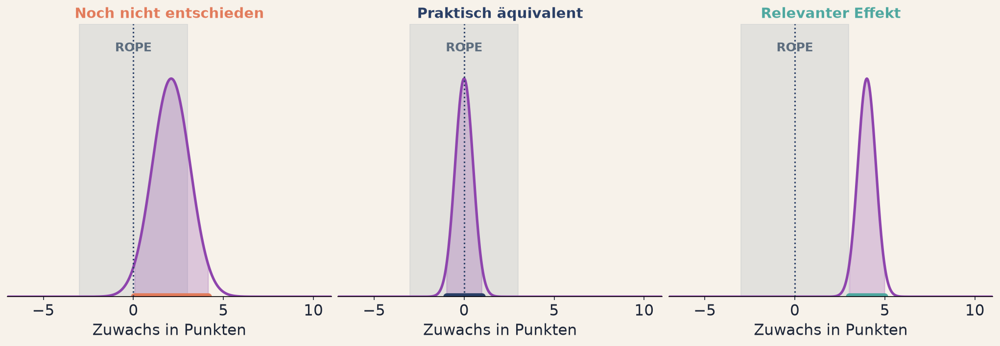
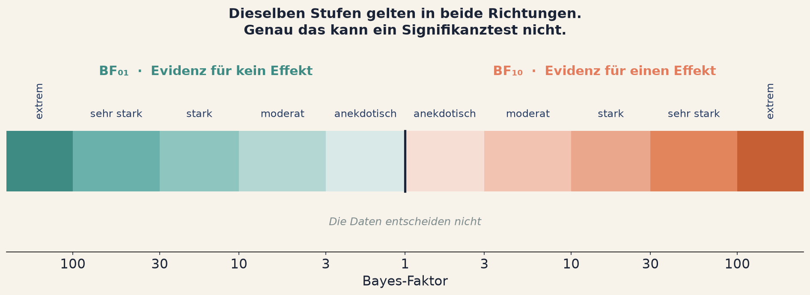

<!--
Verlinkte Seiten dieses Decks, hier zentral pflegen:
  Arbeitsblatt      ../../tag2/e6-evidenz-berichten.html
  App HDI und ROPE  ../../apps/a16-hdi-rope.html
  App Bayes-Faktor  ../../apps/a17-bayesfaktor.html
  App Vorhersage    ../../apps/a18-vorhersage.html
  App MCMC (Puffer) ../../apps/a19-mcmc.html
-->

## Fragerunde: Einheit 5 {background-color="#2A3F66"}

[Kurz zusammentragen]{.bp-eyebrow}

::: {.bp-callout}
Ab wann hat der Prior gewonnen, und würdet ihr einen solchen Prior in einem
Antrag verteidigen können?
:::

::: {.bp-runde}
::: {.bp-runde__gruppe}
[1]{.bp-runde__num}
[Gruppe 1]{.bp-runde__label}
:::
::: {.bp-runde__gruppe}
[2]{.bp-runde__num}
[Gruppe 2]{.bp-runde__label}
:::
::: {.bp-runde__gruppe}
[3]{.bp-runde__num}
[Gruppe 3]{.bp-runde__label}
:::
::: {.bp-runde__gruppe}
[4]{.bp-runde__num}
[Gruppe 4]{.bp-runde__label}
:::
::: {.bp-runde__gruppe}
[5]{.bp-runde__num}
[Gruppe 5]{.bp-runde__label}
:::
:::

::: notes
Die erste Teilfrage liefert Zahlen, die zweite liefert die Diskussion.

Auf der Tafel die Prior-Breiten sammeln, ab denen die Gruppen den Kipppunkt
gesehen haben. Die Streuung zwischen den Gruppen ist der Punkt: es gibt keine
feste Grenze, es ist ein Verhältnis zwischen Priorbreite und Datenmenge.

Bei der zweiten Teilfrage kommt regelmäßig der ehrliche Satz, dass man einen
sehr engen Prior nicht verteidigen könnte. Genau darauf will ich hinaus. Ein
Prior, den man nicht begründen kann, ist keiner.

Überleitung: "Ihr habt jetzt eine Posterior. Was macht ihr damit? Eine Zahl
allein ist noch keine Entscheidung."
:::

# Einheit 6 {.bp-trenner background-color="#2A3F66"}

[Tag 2 · Die Alternative]{.bp-eyebrow}

## Evidenz berichten

::: notes
Kurz. Letzte Inhaltseinheit, ab hier geht es nur noch um Anwendung.
:::

## Was heißt "kein Effekt gefunden"?

::: {.bp-aufgabe}
Eine Evaluation findet keinen signifikanten Effekt von LeseStark.

Die Pressemitteilung sagt: **"Das Programm wirkt nicht."**
:::

::: {.bp-handzeichen}
Handzeichen, wer diesen Satz so unterschreiben würde.
:::

::: notes
Fast niemand hebt die Hand, und das ist auch gut so. Nach anderthalb Tagen weiß
die Gruppe, dass dieser Schluss nicht zulässig ist.

Die Anschlussfrage ist die eigentliche: "Was hättet ihr stattdessen
geschrieben?" Zwei oder drei Antworten einsammeln.

Was fast immer kommt: "Wir konnten keinen Effekt nachweisen." Und das ist der
entscheidende Punkt, den ich dann setze: dieser Satz ist korrekt, aber er ist
leer. Er sagt der Leserin nicht, ob das Programm wirkungslos ist oder ob die
Studie zu klein war. Das sind sehr verschiedene Dinge mit sehr verschiedenen
Konsequenzen.

Genau diese Lücke schließt diese Einheit. Der Signifikanztest kann sie nicht
schließen, konstruktionsbedingt.

Rund 2 Minuten.
:::

## Aus einer Verteilung eine Entscheidung machen

{.bp-abb}

::: {.bp-warn}
**Unser Fall** ist der linke. Relevanzschwelle 3 Punkte, HDI von 0,0 bis 4,2,
Überlappung mit der ROPE. Die ehrliche Antwort: noch nicht entschieden.
:::

::: notes
Die Folie, die aus Statistik eine Entscheidung macht.

Die drei Panels der Abbildung einzeln durchgehen. In allen drei ist das graue
Band die ROPE, also der Bereich, den man als praktisch bedeutungslos
festgelegt hat. Die violette Kurve ist die Posterior, der dicke Balken darunter
das HDI.

Links: das HDI ragt aus der ROPE heraus, liegt aber nicht ganz außerhalb.
Unentschieden. Das ist unser Fall.

Mitte: das HDI liegt vollständig in der ROPE. Praktisch äquivalent zu null,
und das ist ein echtes Ergebnis.

Rechts: das HDI liegt vollständig außerhalb. Relevanter Effekt.

Erst danach die Begriffe HDI, ETI und ROPE benennen. Das Bild zuerst, die
Vokabeln danach. Umgekehrt steigen Leute aus.

ROPE ist die Brücke zurück zu Einheit 3. Die Relevanzschwelle, die dort
inhaltlich bestimmt wurde, wird hier zum Kriterium. Nicht mehr "ist der Effekt
von null verschieden", sondern "ist er groß genug, dass es zählt".

Der Warnkasten ist der wichtigste Teil und bewusst unbequem. Unsere Studie aus
Einheit 1, die frequentistisch als signifikant durchgegangen wäre, ist auf der
Relevanzebene unentschieden. Das ist kein Mangel der Methode, das ist die
ehrliche Auskunft.

Drei mögliche Ausgänge nennen: HDI komplett außerhalb der ROPE heißt relevanter
Effekt. HDI komplett innerhalb heißt praktisch äquivalent zu null, und das ist
ein echtes Ergebnis. Überlappung heißt, die Daten reichen noch nicht.

Der dritte Ausgang ist der, den der Signifikanztest nicht kennt, und der
mittlere ist der, den er nie liefern kann.

Rund 5 Minuten.
:::

## Der Bayes-Faktor: Evidenz in beide Richtungen

{.bp-abb .bp-abb--knapp}

::: {.bp-warn}
Wer BF > 3 zum neuen p < .05 macht, hat das Ritual umbenannt, nicht
überwunden.
:::

::: {.bp-quelle}
Stufen nach Lee & Wagenmakers (2013).
:::

::: notes
Die Symmetrie ist der Nutzen-Beweis dieser Einheit. Darauf hinarbeiten.

Die Abbildung trägt genau das: eine Leiter, in der Mitte der Bayes-Faktor 1.
Nach rechts wächst die Evidenz für einen Effekt, nach links die Evidenz gegen
einen Effekt, und die Stufen heißen auf beiden Seiten gleich. Erst die linke
Hälfte macht den Unterschied zum Signifikanztest sichtbar, denn dort hat er
nichts anzubieten.

Der Signifikanztest kennt zwei Ausgänge, einen Effekt oder nichts. Der
Bayes-Faktor kennt drei: Evidenz dafür, Evidenz dagegen, und zu wenig Daten.
Das ist die Mitte der Leiter.

Für dieses Publikum die Anwendung sofort benennen: Wirksamkeitsnachweise,
Nicht-Unterlegenheitsstudien, und der häufigste Fall überhaupt, die Frage, ob
eine teure Maßnahme einer billigen tatsächlich überlegen ist. Wer zeigen will,
dass zwei Verfahren gleichwertig sind, kann das mit einem Signifikanztest
grundsätzlich nicht.

Der Rückbezug zur Folie davor: die Pressemitteilung hätte lauten können "Die
Daten liefern moderate Evidenz dafür, dass das Programm keinen relevanten
Effekt hat" oder "Die Daten reichen für eine Aussage noch nicht aus". Das sind
zwei völlig verschiedene Meldungen, und beide sind berichtbar.

Warnung an mich selbst, laut aussprechen: die Stufentabelle ist eine
Orientierung, keine neue Schwelle. Wer BF > 3 zum neuen p < .05 macht, hat das
Ritual umbenannt, nicht überwunden. Diesen Satz sage ich ausdrücklich, sonst
nimmt die Hälfte des Raums genau das mit.

Rund 5 Minuten.
:::

## Posterior oder Vorhersage?

::: {.bp-zwei}
::: {.bp-pillar .tone-navy}
[Unsicherheit 01]{.bp-pillar__num}

### Epistemisch

Wie sicher bin ich mir über den **Durchschnittseffekt**? Schrumpft mit mehr
Daten.
:::
::: {.bp-pillar .tone-coral}
[Unsicherheit 02]{.bp-pillar__num}

### Aleatorisch

Wie stark streuen **einzelne Lernende**? Bleibt, egal wie viele Daten du
sammelst.
:::
:::

::: {.bp-callout}
Die Vorhersage für den Einzelfall ist deshalb **immer breiter** als die
Posterior für den Mittelwert. "Das Programm bringt 2,1 Punkte" und "dieses
Kind gewinnt 2,1 Punkte" sind zwei verschiedene Versprechen, und nur eines
davon kannst du halten.
:::

::: notes
Kurz, aber nicht weglassen. Die Verwechslung ist im Alltag ständig relevant und
wird ständig gemacht.

Der Satz, der für dieses Publikum zählt: "Das Programm bringt im Schnitt 2,1
Punkte" und "Dieses Kind wird 2,1 Punkte gewinnen" sind völlig verschiedene
Aussagen mit völlig verschiedener Unsicherheit. Die zweite braucht die
Posterior-Predictive, und die ist unangenehm breit. Genau deshalb wird sie fast
immer weggelassen.

Wer mit Förderentscheidungen für einzelne Lernende zu tun hat, ist genau hier
betroffen.

In der Anwendung liegen zwei Kurven übereinander, die Vorhersage ist sichtbar
breiter. Dieses eine Bild reicht als Begründung.

Rund 3 Minuten.
:::

## Dasselbe dreimal

::: {.bp-drei}
::: {.bp-pillar .tone-teal}
[Ohne Code]{.bp-pillar__num}

### JASP und Jamovi

Bayesianischer **t-Test, ANOVA und Regression** per Klick, direkt neben den
klassischen Verfahren.

**Der Einstieg für heute Abend.**
:::
::: {.bp-pillar .tone-navy}
[Mit R]{.bp-pillar__num}

### BayesFactor, bayestestR, brms

Vom fertigen Bayes-Faktor bis zum eigenen Modell in lme4-Schreibweise.
:::
::: {.bp-pillar .tone-sand}
[Mit Python]{.bp-pillar__num}

### PyMC, ArviZ, Stan

Modell frei spezifizieren, Diagnostik inklusive. Für Mehrebenen- und
Messmodelle.
:::
:::

::: {.bp-warn}
Alle drei rechnen die Posterior nicht aus, sie simulieren sie (**MCMC**). Ein
nicht konvergiertes Modell liefert trotzdem Zahlen, und die sehen aus wie
richtige.
:::

::: notes
Die Folie, die verhindert, dass alles Theorie bleibt. Drei Wege, klar nach
Vorkenntnis sortiert.

Der Satz, der hier zählt: t-Test, ANOVA und Regression gibt es alle
bayesianisch, und die Logik ist in allen drei Fällen dieselbe. Statt eines
p-Werts je Parameter bekommst du eine Posterior je Parameter, und damit alles,
was wir heute damit gemacht haben: Intervall, Relevanzaussage, Bayes-Faktor in
beide Richtungen. Wer die Regressionstabelle lesen kann, kann auch die
bayesianische lesen.

JASP ist der Einstieg, den ich empfehle, und zwar heute Abend. Es ist
kostenlos, installiert in zwei Minuten und rechnet genau diese drei Verfahren
zusätzlich bayesianisch, direkt neben dem klassischen Ergebnis. Der Aufwand
ist praktisch null.

Wir codieren hier nichts, die Werkzeugfolie ist Orientierung. Für R den Bogen
nennen: BayesFactor liefert fertige Bayes-Faktoren für die
Standardverfahren, bayestestR macht HDI und ROPE zu einem Einzeiler, brms
nimmt die lme4-Formelschreibweise für eigene Modelle. Wer schon
Mehrebenenmodelle rechnet, muss fast nichts Neues lernen.

Python nur erwähnen, nicht ausführen. PyMC für das Modell, ArviZ für
Diagnostik und Darstellung. Für dieses Publikum ist der relevante Hinweis,
dass Mehrebenen- und IRT-Modelle dort natürlich bayesianisch formuliert
werden.

Die Adressen stehen alle auf der Quellenseite, darauf verweisen statt sie
vorzulesen.

Der Warnkasten ist die einzige Stelle, an der MCMC vorkommt, und das reicht für
heute. Wer mehr will, findet die Anwendung dazu als Pufferaufgabe auf dem
Arbeitsblatt.

Rund 3 Minuten.
:::

## Gleich baut ihr die Entscheidung selbst

In der Anwendung legt ihr die ROPE selbst fest und seht sofort, welcher der
drei Ausgänge herauskommt.

::: {.bp-callout}
Die spannende Frage ist nicht, wo das HDI liegt. Sie lautet: **wo setzt ihr die
Relevanzschwelle, und könnt ihr sie begründen?**
:::

::: {.bp-demo-hinweis}
Anwendung: **HDI und ROPE** · [zum Selbstausprobieren](../../apps/a16-hdi-rope.html)
:::

::: notes
Diese Folie kauft die Ladezeit für die letzte Anwendung des Workshops.

In der Demo nur eine Sache zeigen: die ROPE-Grenzen von 3 auf 1 Punkt ziehen und
beobachten, wie aus "unentschieden" ein klares Ergebnis wird, ohne dass sich an
den Daten irgendetwas geändert hat. Das ist der letzte und wichtigste Aha-Moment
des Workshops.

Und sofort die unbequeme Konsequenz benennen: die Relevanzschwelle ist damit
genauso manipulierbar wie alles andere. Der Unterschied ist, dass man sie vorher
festlegen und begründen muss, und dass sie im Bericht steht.

Das ist die kürzbare Folie dieser Einheit.

Rund 2 Minuten, plus die Demo selbst.
:::

# Jetzt seid ihr dran {.bp-trenner background-color="#4FA8A0"}

[Gruppenarbeit in den Breakout-Räumen]{.bp-eyebrow}

## Gruppenarbeit 6 {background-color="#4FA8A0"}

::: {.bp-aufgabe}
**Die Frage für eure Gruppe:** Formuliert den Ergebnissatz für LeseStark, so wie
ihr ihn einer Kommission vorlegen würdet. Ein Satz. Mit Zahl, Intervall und
Relevanzaussage.
:::

::: {.bp-demo-hinweis}
Alle Aufgaben, Auffrischungen und Lösungen: [Arbeitsblatt Einheit 6](../../tag2/e6-evidenz-berichten.html)
:::

::: notes
Die letzte Gruppenarbeit und zugleich die Vorbereitung des Abschlusses. Das
ansagen: was ihr hier formuliert, tragt ihr gleich vor, und daraus wird der
Schlusspunkt der beiden Tage.

Auf dem Arbeitsblatt steht ein Muster, an dem sich die Gruppen orientieren
können, aber sie sollen es nicht abschreiben. Die eigene Formulierung ist der
Lerneffekt.

Als Pufferaufgabe gibt es die MCMC-Anwendung und die Vorhersage-Anwendung. Für
Gruppen, die früh fertig sind, ist die bessere Aufgabe aber: denselben Satz
noch einmal für eine Pressemitteilung schreiben, also ohne Fachbegriffe. Das
ist schwerer, als es klingt.

Nach 23 Minuten die Ansage: noch fünf Minuten, einigt euch auf einen Satz.

Rund 1,5 Minuten.
:::
